# LangChain

## 1. 什么是 LangChain？

### LangChain

LangChain 可以简单理解为：

> **就是一套把大模型和外部世界连接起来的工具代码。**

它可以帮助我们把 **大语言模型** 和各种外部工具、数据、接口连接起来，让大模型不仅能够聊天，还能够完成实际任务。

例如：

```text
用户
 ↓
LangChain
 ↓
大模型
 ↓
数据库 / 文件 / API / 搜索等外部工具
 ↓
返回结果
```

------

## 2. LangChain 和 LangChain4J

### LangChain

主要用于：

> **LangChain for Python**

也就是使用 Python 开发基于大模型的应用。

### LangChain4J

可以简单理解为：

> **LangChain for Java**

也就是使用 Java 开发类似的 AI 大模型应用。

因此可以简单记忆：

```text
LangChain
    ↓
Python

LangChain4J
    ↓
Java
```

------

## 3. AB法则（Before / After）

学习 LangChain 的时候，可以使用 **AB 法则** 来理解它。

### Before

在没有使用 LangChain 的情况下：

```text
用户
 ↓
自己编写代码
 ↓
调用大模型
 ↓
自己处理数据
 ↓
自己调用外部工具
```

需要自己编写很多代码。

### After

使用 LangChain 后：

```text
用户
 ↓
LangChain
 ↓
大模型
 ↓
各种外部工具
 ↓
返回结果
```

LangChain 帮我们把大模型和外部世界的各种工具连接起来，减少开发过程中需要自己编写的重复代码。

------

## 4. 一句话理解

> **LangChain 就是一套把大模型和外部世界连接起来的工具代码。**

## 官方地址

### 官方文档

#### 英文[LangChain Python 官方英文文档](https://docs.langchain.com/oss/python/langchain/overview?utm_source=chatgpt.com)

#### 中文[LangChain Python 官方中文文档](https://docs.langchain.org.cn/oss/python/langchain/overview?utm_source=chatgpt.com)

------

## 3. GitHub 地址

LangChain 的源码以及项目相关内容可以在 GitHub 查看：

[LangChain GitHub](https://github.com/langchain-ai/langchain?utm_source=chatgpt.com)

------

## 4. API 文档

如果需要查询某个类、方法或者参数的具体用法，可以查看 API 文档：

[LangChain API Reference](https://reference.langchain.com/python/langchain/?utm_source=chatgpt.com)

API 文档主要用于：

> **查具体的类、方法、参数以及返回值。**

# Python + LangChain 安装依赖包

想让当前虚拟环境以后默认走清华源，可先执行：

```bash
pip config set global.index-url https://pypi.tuna.tsinghua.edu.cn/simple

pip install langchain

pip install langchain-openai

pip install openai

pip install python-dotenv

pip install langchain-core
```

# LangChain ：阿里云百炼平台与通义千问模型接入

在使用 LangChain 进行大模型开发时，首先需要完成基础模型的接入配置。本文整理了基于**阿里云百炼平台**（DashScope）接入通义千问（Qwen）大模型的核心要点与调用配置。

---

## 1. 平台入口

* **阿里云百炼控制台官网**：[https://bailian.console.aliyun.com/](https://bailian.console.aliyun.com/)

---

## 2. 大模型调用“三件套”

要通过 API 或 SDK（包括 LangChain 框架）成功调用阿里云百炼平台上的通义千问模型，必须准备好以下三个核心参数：

| 参数名称                   | 说明                                                 | 示例 / 值                                                    |
| :------------------------- | :--------------------------------------------------- | :----------------------------------------------------------- |
| **1. API Key**             | 用于身份验证和计费鉴权                               | `sk-xxx`（请替换为您在百炼后台申请的真实 API Key）           |
| **2. 模型名 (Model)**      | 指定调用的具体大模型版本                             | `qwen3.7-plus`<br>`qwen3.7-max`                              |
| **3. Base URL (调用地址)** | 使用 OpenAI 兼容模式 SDK 或 LangChain 时的接口基地址 | `https://ws-fi6jxdfibykrqgn3.cn-beijing.maas.aliyuncs.com/compatible-mode/v1` |

---

## 3. LangChain / Python 快速接入示例

使用 LangChain 通用初始化函数 (`init_chat_model`) 【推荐】

阿里云百炼平台提供了兼容 OpenAI 格式的接口。LangChain 推荐使用统一函数 `init_chat_model`，通过指定 `model_provider="openai"` 快速接入：

### HelloWorldV1：

```python
import os
from langchain.chat_models import init_chat_model

# 1. 实例化模型（OpenAI 兼容模式）
model = init_chat_model(
    model="qwen3.7-plus",  # 指定模型名称（如 qwen3.7-plus / qwen3.7-max）
    model_provider="openai",  # 指定提供商接口类型
    api_key=os.getenv("aliQwen_api"),  # 从环境变量获取 API Key
    base_url="[https://ws-fi6jxdfibykrqgn3.cn-beijing.maas.aliyuncs.com/compatible-mode/v1](https://ws-fi6jxdfibykrqgn3.cn-beijing.maas.aliyuncs.com/compatible-mode/v1)"  # 阿里百炼兼容接口地址
)

# init_chat_model 无法自动识别 qwen3.7-plus 对应的服务商，阿里云通义千问兼容 OpenAI 接口
# 底层代码要用 openAI 驱动，需要手动指定 model_provider="openai"

# 2. 调用模型并打印输出
response = model.invoke("Hello, 你是谁，50字内回复")
print(response.content)

```

> 在 LangChain 中，当我们调用 `model.invoke(...)` 时，返回的不是单纯的字符串，而是一个**完整的大模型响应对象**（在 LangChain 中通常称为 `AIMessage` 对象）。
>
> 如果你直接打印 `response`（而不是 `response.content`），或者打印其底层原始字典，就能看到完整的数据结构。

## 动嘴编程 - 提示词

### 模版

```m
核心思路：分层结构化提示词（效果最优）
设计逻辑（教学原理）
身份定位：明确我是 Python LangChain 代码生成助手，只输出可运行完整代码；
硬性约束：指定使用init_chat_model、阿里云通义千问兼容 OpenAI 模式、固定参数；
代码规范要求：注释风格、变量命名、注释说明、代码结构分段；
输出格式限制：只给代码，附带极简解释，不冗余；
补充避坑规则：环境变量、接口地址、provider 固定值。
```

### 案例提示词(标准版)

```markdown
【角色】你是专业LangChain Python代码生成助手，只输出完整可运行代码，附带少量行内注释与分段注释。
【需求】使用 langchain.chat_models.init_chat_model 实例化阿里云通义千问兼容OpenAI接口模型。
【强制固定参数，不可修改】
1. model名称："qwen3.7-max"
2. model_provider："openai"
3. api_key读取方式：os.getenv("aliQwen_api")，注释说明密钥存本地环境变量
4. base_url固定地址：https://ws-fi6jxdfibykrqgn3.cn-beijing.maas.aliyuncs.com/compatible-mode/v1
【代码结构要求】
1. 顶部导入os和init_chat_model
2. 分两段：第一段实例化模型，添加注释解释关键字参数；第二段调用invoke完成对话
3. invoke入参："你是谁，50字内回复"，打印.content
4. 注释清晰、代码整洁、分段换行规范
【输出要求】仅输出完整Python代码，不要多余文字，代码注释完整易懂
```

# DeepSeek API

## 官方资源
- **DeepSeek 官网**：[https://www.deepseek.com/](https://www.deepseek.com/)
- **用量信息**：[https://platform.deepseek.com/usage](https://platform.deepseek.com/usage)
- **获取 API Key**：[https://platform.deepseek.com/api_keys](https://platform.deepseek.com/api_keys)
- **API 编码开发文档（中文）**：[https://api-docs.deepseek.com/zh-cn/](https://api-docs.deepseek.com/zh-cn/)

---

## 开发前准备（大模型调用三件套）

### 1. 获取 API Key
- 访问 [API Keys 管理页面](https://platform.deepseek.com/api_keys)
- 登录后创建或复制已有的 API Key（注意保密）

### 2. 获取模型名称
- 参考官方文档中支持的模型列表（如 `deepseek-v4-pro`、`deepseek-v4-flash` 等）
- 根据实际场景选择合适的模型

### 3. 获取 Base URL
- 开发地址 base_url (OpenAI) 通常为：`https://api.deepseek.com`
- 具体路径请查阅 [API 文档](https://api-docs.deepseek.com/zh-cn/)

## 动嘴编程

```markdown
【角色】你是专业LangChain Python代码生成助手，只输出完整可运行代码，附带少量行内注释与分段注释。
【需求】使用 langchain.chat_models.init_chat_model 实例化阿里云通义千问兼容OpenAI接口模型。
【强制固定参数，不可修改】
1. model名称：一个py文件里定义两个model，一个是"qwen3.7-max"，另一个是deepseek-v4-pro
2. model_provider："openai"
3. 两个api_key读取方式：os.getenv("aliQwen_api")，    api_key=os.getenv("deepseek_api"),# 从环境变量配置中读取
4. 两个base_url固定地址：https://dashscope.aliyuncs.com/compatible-mode/v1，base_url="https://api.deepseek.com"
【代码结构要求】
1. 顶部导入os和init_chat_model
2. 分两段：第一段实例化模型，添加注释解释关键字参数；第二段调用invoke完成对话
3. invoke入参："你是谁，50字内回复"，打印.content
4. 注释清晰、代码整洁、分段换行规范
【输出要求】仅输出完整Python代码，不要多余文字，代码注释完整易懂
【其它要求】
同一个py文件里面，分别调用千问和deepseek两个模型
```

### HelloWorldV2：

``` python
# ==================== 导入依赖 ====================
import os
from langchain.chat_models import init_chat_model

# ==================== 实例化两个模型 ====================
# 要求同时存在多种大模型产品在系统里共存使用
# 1. 实例化阿里云通义千问模型（兼容 OpenAI 接口）
qwen_model = init_chat_model(
    model="qwen3.7-max",               # 指定模型名称
    model_provider="openai",           # 指定提供商为 OpenAI 兼容模式
    api_key=os.getenv("aliQwen_api"),  # 从环境变量读取 API Key（本地需提前设置）
    base_url="https://ws-fi6jxdfibykrqgn3.cn-beijing.maas.aliyuncs.com/compatible-mode/v1",  # 阿里云百炼兼容接口地址
)

# 2. # 通过阿里云百炼平台调用deepseek，通过中转调用，先阿里 → deepseek
deepseek_model = init_chat_model(
    model="deepseek-v4-pro",           # 指定模型名称
    model_provider="openai",           # 指定提供商为 OpenAI 兼容模式
    api_key=os.getenv("deepseek_api"), # 从环境变量读取 API Key（本地需提前设置）
    base_url="https://ws-fi6jxdfibykrqgn3.cn-beijing.maas.aliyuncs.com/compatible-mode/v1",  # 阿里云百炼兼容接口地址
)

# ==================== 分别发起对话调用 ====================
# 调用通义千问模型并传入用户问题，获取响应
qwen_response = qwen_model.invoke("你是谁，50字内回复")
print("【通义千问】:", qwen_response.content)

# 调用 DeepSeek 模型并传入用户问题，获取响应
deepseek_response = deepseek_model.invoke("你是谁，50字内回复")
print("【DeepSeek】:", deepseek_response.content)
```

# Python-dotenv 环境变量管理

### 一、什么是 python-dotenv？

`python-dotenv` 是一个 Python 库，用于从 `.env` 文件中读取键值对并将其设置为环境变量。这样可以将敏感信息（如 API 密钥、数据库密码等）与代码分离，提高安全性和可维护性。

### 1. 安装 python-dotenv

```bash
pip install python-dotenv
```

### 2. 在项目根目录创建 `.env` 文件

### 3. 编辑 `.env` 文件，填入你的密钥

```text
# 阿里云通义千问 API Key
aliQwen_api=你的通义千问实际密钥

# DeepSeek API Key
deepseek_api=你的DeepSeek实际密钥
```

### 4. 将 `.env` 加入 `.gitignore`（防止提交到仓库）

```bash
# bash：
# 在 .gitignore 中添加
echo ".env" >> .gitignore
```

### 5. 编写python代码时，引入load_dotenv()

```python
# load_dotenv() 一定要在读取环境变量代码前面，否则读取不到.env配置：
load_dotenv(encoding="utf-8")
```

### HelloWorldV3

```python
# 1.导入依赖
from dotenv import load_dotenv
from langchain.chat_models import init_chat_model
import os
# .env文件读取
load_dotenv()

# 3.实例化模型
# base_url地址已经更换，直接访问deepseek
model = init_chat_model(
    model="deepseek-v4-pro",
    #model_provider="deepseek",
    api_key=os.getenv("deepseek_api"),# 从环境变量配置中读取

    base_url="https://api.deepseek.com"
)

# 3.调用模型
#print(model.__dict__)
print(model.invoke("你是谁").content)
```

# 铺垫延展LangGraph

核心理念变革：从“链式”到“图状”思维

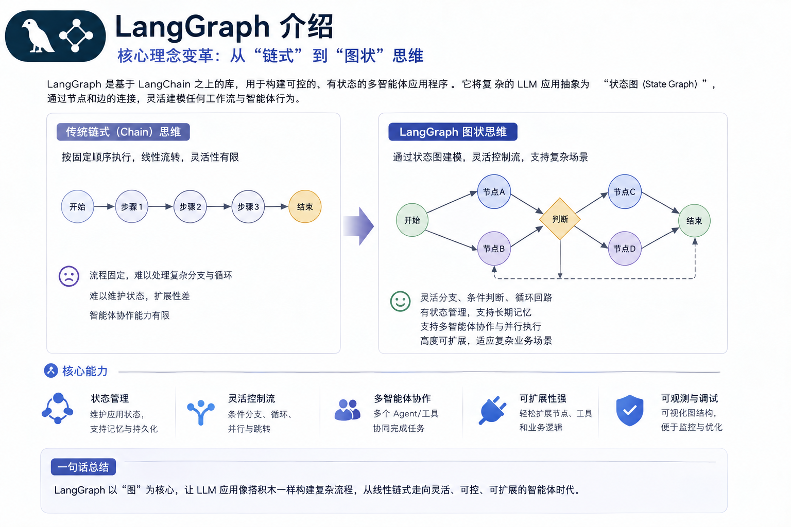

# Model I/O大模型接口

### 是什么

**LangChain 的 Model I/O 模块是与大模型进行交互的核心组件**

Model I/O：标准化各个大模型的输入和输出，包含输入模版，模型本身和格式化输出。

### I/O三件套

输入提示（Format）：

​	即指代Prompts Template提示词模板，通过模板管理大模型的输入。

​	将原始数据格式化成模型可以处理的形式，插入到一个模板问题中，然后送入模型进行处理

调用模型（Predict）：

​	即指代Models，使用通用接口调用不同的大语言模型。接受被送进来的问题，然后基于这个问题进行预测或生成回答。

输出解析（Parse）：

​	即指代Output Parser 部分，用来从模型的推理中提取信息，并按照预先设定好的模版来规范化输出。比如，格式化成一个结构化的JSON对象

> 一句话：简单来说，就是输入、处理、输出这三个步骤。

### Model I/O之调用模型

一个 AI 应用的核心就是它所依赖的大语言模型，LangChain作为一个“工具”，不提供任何 LLMs，而是依赖于第三方集成各种大模型。比如：将 OpenAI、Anthropic、Hugging Face 、LlaMA、阿里Qwen、ChatGLM等平台的模型无缝接入到你的应用

LangChain 模型接口可参考官方文档：https://reference.langchain.com/python/langchain_core/language_models/

### Model I/O之分类

LangChain中将大语言模型分为以下几种，我们主要使用的是聊天对话模型

| 模型类型                   | 输入形式                                                     | 输出形式                       | 主要特点                                                     | 典型适用场景                                                 |
| :------------------------- | :----------------------------------------------------------- | ------------------------------ | ------------------------------------------------------------ | ------------------------------------------------------------ |
| LLM (Large Language Model) | 纯文本字符串                                                 | 文本字符串                     | 1. 最基础的文本生成模型<br>2. 无上下文记忆<br>3. 高速、轻量  | 1. 单轮问答<br>2. 摘要生成<br>3. 文本改写/扩写<br>4. 指令执行（Instruct 模型） |
| ChatModel（聊天模型）      | 消息列表（List[BaseMessage]）包括 HumanMessage, SystemMessage, AIMessage 等 | 聊天消息对象（AI Message）     | 1. 面向对话场景<br>2. 支持多轮上下文<br>3. 更贴近人类对话逻辑 | 1. 智能助手<br>2. 客服机器人<br>3. 多轮推理任务<br>4. LangChain Agent 工具调用 |
| Embeddings（文本向量模型） | 文本字符串或列表（str 或 list[str]）                         | 向量（list[float] 或 ndarray） | 1. 将文本转化为语义向量<br>2. 可用于相似度搜索<br>3. 通常不生成文本 | 1. 文本检索增强（RAG）<br>2. 知识库问答<br>3. 聚类 / 分类 / 推荐系统 |

### Model I/O之模型参数

官网：https://docs.langchain.com/oss/python/langchain/models#parameters

在构建聊天模型时init_chat_model，有一些标准化参数：

| 参数名      | 参数含义                                                     |
| ----------- | ------------------------------------------------------------ |
| model       | 指定使用的大语言模型名称（如 "gpt-4"、"gpt-3.5-turbo" 等）   |
| temperature | 温度，温度越高，输出内容越随机；温度越低，输出内容越确定     |
| timeout     | 请求超时时间                                                 |
| max_tokens  | 生成内容的最大token数                                        |
| stop        | 模型在生成时遇到这些"停止词"将立刻停止生成，常用于控制输出的边界。 |
| max_retries | 最大重试请求次数                                             |
| api_key     | 大模型供应商提供的API秘钥                                    |
| base_url    | 大模型供应商API请求地址                                      |

以上的标准参数，也只是适用于部分的大语言模型，有些参数在特定模型中可能是无效的，这些标准化参数仅对 LangChain 官方提供集成包的模型（如 langchain-openai、langchain-anthropic）生效，在langchain-community包中的第三方模型，则不需要遵守这些标准化参数的规则。

案例：

```python
import os

from dotenv import load_dotenv
from langchain.chat_models import init_chat_model

# 读取环境变量
load_dotenv()

# 实例化模型
model = init_chat_model(
    model="deepseek-v4-pro",
    api_key=os.getenv("DEEPSEEK_API_KEY"),
    base_url="https://api.deepseek.com",
    temperature=2.0
  	# temperature=0.1
)

# 调用模型
for x in range(3):
    print(model.invoke("写一句关于春天的词,14字以内").content)
```

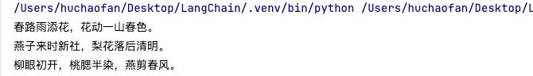

> temperature：越小越稳定；越大越发散

### Model I/O之模型返回（元数据）

Message组件:

​	调用模型后返回了一条AI消息: AIMessage

​	所有消息都有 type 、 content 、 response_metadata 等属性

| 属性名            | 属性作用                                                     |
| ----------------- | ------------------------------------------------------------ |
| type              | 描述了是哪个类型的消息，包含类型有"user"、"ai"、"system"和"tool" |
| content           | 通常是字符串，有些情况下可能是字典列表，这个字典列表用于大模型的多模态输出。 |
| name              | 用来区分当前消息类型相同，对消息进行区分，但不是所有模型都支持这一功能。 |
| response_metadata | AI消息才会包含的属性，大语言模型的响应中附加元数据，根据不同模型会有不同，如可能会包含本次 token 使用量等信息。 |
| tool_calls        | AI消息才会包含的属性，当大语言模型决定调用工具时，在 AIMessage 中就会包含这个属性，可以通过 .tool_calls 属性进行获取该属性返回一个 ToolCall 列表，每个 ToolCall 是一个字典，包含以下字段：name：应调用的工具名 args：调用工具的参数 id：工具调用的唯一标识 ID。 |

### 接入大模型

https://docs.langchain.com/oss/python/integrations/providers/overview#popular-providers

1. 接入OPENAI

   ```python
   from langchain_openai import ChatOpenAI
   import os
   
   chatLLM = ChatOpenAI(
       api_key=os.getenv("aliQwen-api"),
       base_url="https://dashscope.aliyuncs.com/compatible-mode/v1",
       # 此处以qwen3.7-plus为例，您可按需更换模型名称。
       # 模型列表：https://help.aliyun.com/zh/model-studio/models
       model="qwen3.7-plus",
       # other params...
   )
   
   messages = [
       {"role": "system", "content": "You are a helpful assistant."},
       {"role": "user", "content": "你是谁？"}]
   
   response = chatLLM.invoke(messages)
   
   print(response.content)
   ```

2. 接入DeepSeek

   ```python
   import os
   from langchain_deepseek import ChatDeepSeek
   
   # 初始化 deepseek
   model = ChatDeepSeek(
       model="deepseek-v4-flash",
       temperature=0,
       max_tokens=None,
       timeout=None,
       max_retries=2,
       api_key=os.getenv("deepseek-api"),
   )
   
   # 打印结果
   print(model.invoke("什么是LangChain?100字以内回答，简洁"))
   ```

3. 接入通义千问（OpenAI 兼容模式；阿里云百炼模式）

   ```python
   
   # pip install langchain-community
   # pip install dashscope
   # https://bailian.console.aliyun.com/cn-beijing/?tab=api#/api/?type=model&url=2587654
   import os
   from langchain_community.chat_models.tongyi import ChatTongyi
   from langchain_core.messages import HumanMessage
   
   chatLLM = ChatTongyi(
       model="qwen-plus",
       api_key=os.getenv("aliQwen_api"),
       streaming=True
   )
   
   # 同步调用
   res_invoke = chatLLM.invoke("你是谁")
   print(res_invoke.content)
   print("*" * 60)
   
   # 流式调用stream()
   res_stream = chatLLM.stream([HumanMessage(content="你好，你是谁")])
   for r in res_stream:
       print("chat resp:", r.content, end="\n")
   ```

# Ollama 本地大模型部署

### LangChain官网

https://docs.langchain.com/oss/python/integrations/chat/ollama

### 是什么

Ollama 是一个用于在本地运行和管理大语言模型（LLMs）的工具。

Docker Hub玩镜像

Ollama Hub玩模型

### 能干嘛

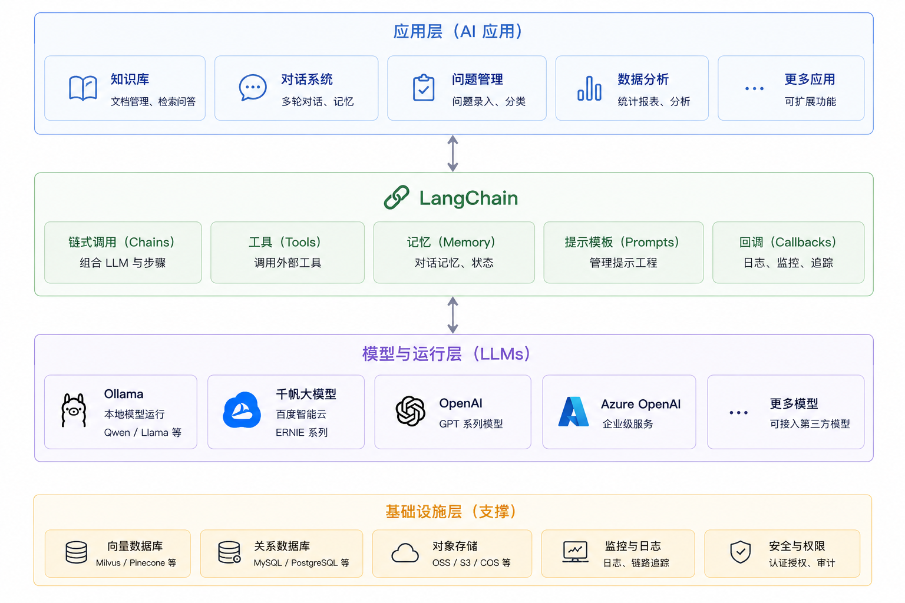

### 去哪下

https://ollama.com/download

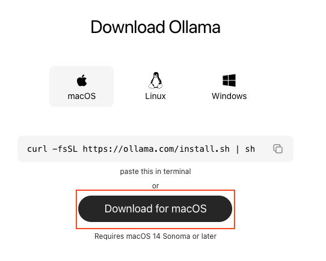

### 怎么玩

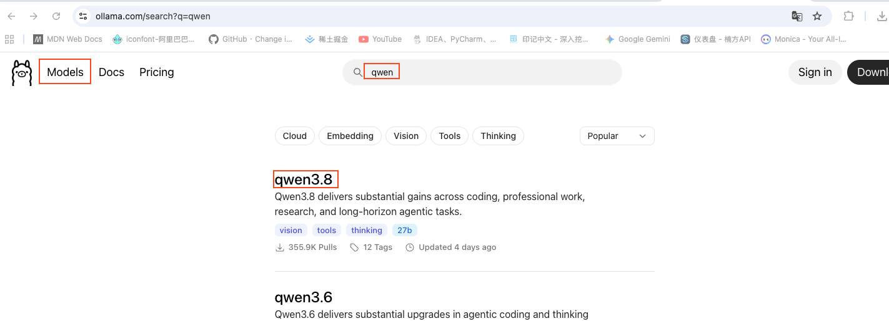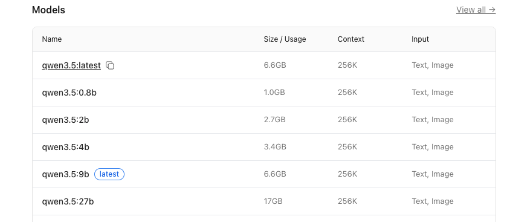


```bash
# 这个命令会自动完成下载 + 运行
# 如果你的本地有这个模型，直接运行，如果没有，去远程拉
ollama run qwen3.5:0.8b
```

### 常用命令

| 命令                                  | 一句话说明                         |
| ------------------------------------- | ---------------------------------- |
| `ollama pull qwen2.5`                 | 下载指定模型（例：qwen2.5）。      |
| `ollama run qwen2.5`                  | 启动并进入该模型交互对话。         |
| `ollama list`                         | 列出本机已下载的所有模型。         |
| `ollama rm qwen2.5`                   | 删除不再需要的模型以节省磁盘。     |
| `ollama cp qwen2.5 my-qwen2.5`        | 本地复制/重命名模型。              |
| `ollama show qwen2.5`                 | 查看模型详细信息（参数、大小等）。 |
| `ollama create my-model -f Modelfile` | 用自定义 Modelfile 构建新模型。    |
| `ollama serve`                        | 启动后台服务，供 API 调用。        |
| `ollama ps`                           | 查看当前正在运行的模型进程。       |
| `ollama stop qwen2.5`                 | 停止正在运行的模型。               |

### Mac，Windows，Ubantu：查找某个端口对应的进程

`ps -ef | grep 3306`：Ubantu/Mac中查看与 3306 相关的进程

`netstat -ano | findstr 11434`：Windows中用来查看「哪个程序占用了 11434 端口」

> 11434 是 Ollama 的默认端口！
>
> `netstat -ano | findstr 11434` 这个命令它可以帮你确认 **Ollama 是否正在运行**

### 退出

```bash
/bye	# 退出Ollama 的交互式聊天界面
```

### LangChain整合Ollama调用本地大模型

确保你使用的是最新的Ollama版本！

```bash
pip install -qU langchain-ollama
pip install -U ollama
```

代码案例：

```python
from langchain_ollama import ChatOllama
# 设置本地模型，不使用深度思考
model = ChatOllama(base_url="http://localhost:11434", model="qwen2.5:latest", reasoning=False)
# 打印结果
print(model.invoke("你是谁").content)
```

# 提示词PromptTemplate和模型调用方法

## DeepSeek提示词样例

提示库：https://api-docs.deepseek.com/zh-cn/prompt-library/

## 提示词（Prompt）

Prompt是引导AI模型生成特定输出额输入格式，Prompt的设计和措辞会显著影响模型的响应。

### SpringAI

| 消息类型                           | 说明                                                         |
| ---------------------------------- | ------------------------------------------------------------ |
| **SYSTEM** (value: "system")       | 设定AI行为边界/角色定位。指导AI的行为和响应方式，设置AI如何解释和回复输入的USER。 |
| **USER** (value: "user")           | 用户原始提问输入。代表用户的输入，即他们向AI提出的问题、命令或陈述。 |
| **ASSISTANT** (value: "assistant") | AI返回的响应信息，定义为"助手角色"消息。它可以确保上下文能够连贯地交互，记忆对话，积累回答。 |
| **TOOL** (value: "tool")           | 桥接外部服务，可以进行函数调用、支付数据查询等操作，类似调用第三方工具类。 |

### LangChain（四大角色）

| 消息类型                                        | 说明                                                         |
| ----------------------------------------------- | ------------------------------------------------------------ |
| **SystemMessage**                               | 系统消息，type为"system"，告诉大模型当前的背景是什么、应该如何做。**注意**：并不是所有模型提供商都支持这个消息类型。 |
| **HumanMessage**                                | 人类消息，type为"user"，表示来自用户的输入。                 |
| **AI Message**                                  | 表示模型输出的内容，type为"ai"，可以是文本，也可以是调用工具的请求。 |
| **ToolMessage (v1.0) / FunctionMessage (v0.3)** | 工具消息，type为"tool"，用于函数调用结果的消息类型。         |

## python同步异步基本功-前置知识概要⭐️

### 同步 VS 异步：

同步（傻等）：

​	任务 1 发请求 → 阻塞等待接口返回（CPU 闲置）→ 任务 1 结束才执行任务 2

异步（await 切换）：

​	任务 1 发起请求 → await 挂起，切去执行任务 2；

​	任务 2 发起请求 → await 挂起；

​	任意接口先返回，就优先执行对应协程剩余代码。

### 并发 VS 并行：

并发：抢火车票，群里面抢红包，多个request请求去抢同一个资源

并行：吃泡面，一边烧水，一边放调料，独立的两件事在各自同时完成

### 多线程 VS 协程：

多线程：由操作系统内核管理的并发单元，一个进程可以开启多条线程，线程间切换由 OS 调度。

协程：用户态，单线程内的逻辑任务，由 Python 事件循环自行调度，切换不经过操作系统，完全在代码层控制。

多线程（抢占式）抢占式，OS强制切换，不可控。

协程（协作式）协作式，主动 await 交出执行权，可控。

> 一句话总结：
>
> 线程是操作系统管理的 “轻量级进程”，抢占式切换，开销大、有线程安全问题；
>
> 协程是单线程内由代码调度的逻辑任务，仅 await 处切换，开销极低、无需加锁，IO 高并发首选；

### async def 定义协程函数：

```python
# 普通同步函数
def sync_func():
	pass

# 协程函数（异步）
async def async_func():
	pass
```

### await 挂起当前协程，让出CPU

**await 只能写在 async def 内部**

作用：

1. 遇到 IO 耗时操作（网络请求、接口调用、文件读写、数据库）时，暂停当前协程；

2. 把 CPU 控制权交还给事件循环；

3. 等 IO 操作完成后，事件循环再切回这个协程，从暂停处继续执行。

### 事件循环 EventLoop 协程的调度器

#### 相当于异步程序的“总指挥”：

1. 保存所有待执行协程；
2. 某个协程遇到了await IO 阻塞，立即切走；
3. IO 完成收到响应，再把协程放回就绪队列执行；
4. 自动来回切换多个协程，单线程内并发

#### asyncio 库内置了 EventLoop 事件循环：

1. asyncio 库提供 run() 工具；
2. run() 内部实例化一个 EventLoop；
3. EventLoop 作为调度器执行你的协程；
4. 执行结束后关闭 EventLoop。

一句话总结：它是 Python 内置标准异步 IO 库，是实现 async / await 协程并发的事件循环调度器。

#### asyncio -最常用基础 API：

1. asyncio.run()
2. asyncio.create_task() ：并发多个协程，把协程丢进事件循环后台调度，不用等一个结束再跑下一个
3. asyncio.gather() ：并发，批量接收一堆协程，统一等待所有任务完成，收集全部返回结果
4. asyncio.sleep (秒数) ：异步休眠，模拟网络 IO 等待，不会阻塞线程；对比 time.sleep() 是同步阻塞，会卡死整个线程。

#### asyncio 工作流程（极简，面试题）：

1. async def 定义协程函数；
2. asyncio.run() 开启事件循环；
3. 执行协程，遇到 await 暂停当前任务，让出线程；
4. 事件循环调度其他就绪协程执行；
5. IO 操作完成，切回原协程继续执行剩余代码；
6. 所有协程执行完毕，关闭事件循环，程序退出。

> 整体运行逻辑一句话总结：单线程里由事件循环调度一堆协程；遇到网络 / IO 耗时操作时用 await 主动让出 CPU，线程不用阻塞等待，同一线程高效穿插执行多个任务，大幅提升 IO 密集场景的多协程高并发任务。

```python
import asyncio  # 异步编程的核心库
import time
import os
from langchain.chat_models import init_chat_model

'''python中定义异步方法

1 异步核心逻辑：
async 定义协程函数，await 暂停协程等待异步操作，事件循环调度多个协程 “不傻等”，提升耗时操作的执行效率。
    当程序中有多个耗时操作（比如同时请求 10 个接口），异步能让这些操作 “并行等待”，
    总耗时≈最慢的那个，而不是所有操作耗时相加。

2 如果你的代码里用了 await，那么它必须出现在被 async 修饰的函数内部—— 这是 Python 语法强制要求，否则直接报错。
    错误示例（await 不在 async 函数里）
    def normal_func():
        await asyncio.sleep(1)  # await马上红色线，报错：'await' outside async function
        
3 写异步代码套路步骤：
    先写 async 定义函数，里面有耗时操作就加 await，最后用 asyncio.run () 启动，这是最基础也最常用的写法
'''


async def async_call_llm():
    print(" [LLM任务] 开始发送请求到模型...")
    await asyncio.sleep(3)  # 模拟网络传输和模型处理的等待时间
    print(" [LLM任务] 收到模型响应，开始处理结果...")
    print(" [LLM任务] 3秒钟完成！")


async def async_call_database():
    print(" [DB任务] 开始查询数据库...")
    await asyncio.sleep(2)  # 模拟数据库查询的等待时间
    print(" [DB任务] 收到数据库结果，进行数据分析...")
    print(" [DB任务] 2秒完成！")
    print()


async def run_async_tasks():
    print("=== 开始异步执行 ===")
    start_time = time.time()
    # 并发执行两个任务
    await asyncio.gather(async_call_llm(), async_call_database())
    end_time = time.time()
    print(f"=== 总耗时：{end_time - start_time:.2f}秒 ===")


# 3. 启动事件循环（异步程序的“总调度”）
if __name__ == "__main__":
    asyncio.run(run_async_tasks())
```
### zip 元素配对拉链函数

```python
# 定义两个列表（对应你的 questions 和 response）
questions = ["你好吗？", "今天天气真不错", "2+3 = "]
responses = ["我很好", "今天晴天", "5"]

# 用Zip打包，遍历每一对元素
# 整个过程没有任何“压缩数据体积” 的操作，只是单纯的元素配对
# zip() 是 Python 内置函数，用于将多个可迭代对象（列表、元组、字符串等）中对应位置的元素打包成一个个元组，然后返回一个迭代器
for result in zip(questions, responses):
    print(result)  # ('你好吗？', '我很好')...
```

### Python 中 `*` 和`**`的作用：定义时打包 vs 调用时拆包

| 符号       | 位置     | 作用                 | 方向        | 输入 → 输出                               |
| ---------- | -------- | -------------------- | ----------- | ----------------------------------------- |
| `*args`    | 函数定义 | 打包位置参数为元组   | 多个 → 一个 | `func(1,2,3)` → `args=(1,2,3)`            |
| `**kwargs` | 函数定义 | 打包关键字参数为字典 | 多个 → 一个 | `func(a=1,b=2)` → `kwargs={'a':1,'b':2}`  |
| `*list`    | 函数调用 | 拆包列表为位置参数   | 一个 → 多个 | `func(*[1,2,3])` → `func(1,2,3)`          |
| `**dict`   | 函数调用 | 拆包字典为关键字参数 | 一个 → 多个 | `func(**{'a':1,'b':2})` → `func(a=1,b=2)` |

**关键点：位置不同，作用相反！**

- 定义时：`*` 是 **"打包"**（把多个参数收进来）
- 调用时：`*` 是 **"拆包"**（把一个列表发出去）

## 模型调用方法

### 普通调用（invoke，ainvoke）

invoke：普通调用，处理单条输入，等待LLM完全推理完成后在返回调用结果

ainvoke：Langchain提供 ainvoke() 异步调用接口，用于在异步环境（async/await）中高效并行的执行模型推理。它的核心作用是：让你同时调用多个模型请求而不是阻塞主线程------特别适合大批量请求或Web服务场景（如FastAPI）

### 流式调用（stream，astream）

stream：流式响应，是一种逐步返回大模型生成结果的技术，生成一点返回一点，允许服务器将响应内容分批次实时传输给客户端，而不是等待全部内容生成完毕后再一次性返回

```python
# 1.导入依赖
import os
from dotenv import load_dotenv
from langchain.chat_models import init_chat_model
from langchain.messages import HumanMessage,SystemMessage
#通过 python-dotenv 库读取 env 文件中的环境变量，并加载到当前运行的环境中
load_dotenv()

# 2.实例化模型
model = init_chat_model(
    model="qwen-plus",
    model_provider="openai",
    api_key=os.getenv("aliQwen-api"),
    base_url="https://dashscope.aliyuncs.com/compatible-mode/v1"
)

# 构建消息列表
messages = [
    SystemMessage(content="你叫小问，是一个乐于助人的AI人工助手"),
    HumanMessage(content="你是谁")
]

# 3.流式调用大模型
response = model.stream(messages)
print(f"响应类型：{type(response)}") # 响应类型：<class 'generator'>
# 流式打印结果
for chunk in response:
    # 刷新缓冲区 (无换行符，缓冲区未刷新，内容可能不会立即显示)
    print(chunk.content, end="",flush=True)
print("\n")
```

astream：异步流式响应

```python
# 1.导入依赖（新增 asyncio 用于运行异步程序）
import os
import asyncio
from dotenv import load_dotenv
from langchain.chat_models import init_chat_model
from langchain.messages import HumanMessage, SystemMessage

# 通过 python-dotenv 库读取 env 文件中的环境变量，并加载到当前运行的环境中
load_dotenv()

# 2.实例化模型
model = init_chat_model(
    model="qwen-plus",
    model_provider="openai",
    api_key=os.getenv("aliQwen-api"),
    base_url="https://dashscope.aliyuncs.com/compatible-mode/v1"
)

# 构建消息列表
messages = [
    SystemMessage(content="你叫小问，是一个乐于助人的AI人工助手"),
    HumanMessage(content="你是谁")
]

# 3.异步流式调用大模型（定义异步函数）
async def async_stream_call():
    # astream 返回异步生成器，无需 await 修饰，直接赋值
    response = model.astream(messages)
    print(f"响应类型：{type(response)}") # 响应类型：<class 'async_generator'>

    # 异步遍历异步生成器（必须使用 async for，不可用普通 for）
    # 异步遍历异步生成器（必须使用 async for，不可用普通 for）
    # 异步遍历异步生成器（必须使用 async for，不可用普通 for）
    async for chunk in response:
        # 刷新缓冲区，实现流式打印（无换行、即时输出）
        print(chunk.content, end="", flush=True)
    print("\n")

# 4.运行异步函数
if __name__ == "__main__":
    asyncio.run(async_stream_call())
```

### 批处理（batch，abatch）

batch：处理批量输入，一次性向模型提交多个输入并并行处理，从而显著提升吞吐量

abatch：异步处理批量输入

```py
# 1.导入依赖（新增 asyncio 用于运行异步程序）
import os
import asyncio
from dotenv import load_dotenv
from langchain.chat_models import init_chat_model
from langchain.messages import HumanMessage, SystemMessage

# 通过 python-dotenv 库读取 env 文件中的环境变量，并加载到当前运行的环境中
load_dotenv()

# 2.实例化模型
model = init_chat_model(
    model="qwen-plus",
    model_provider="openai",
    api_key=os.getenv("aliQwen-api"),
    base_url="https://dashscope.aliyuncs.com/compatible-mode/v1"
)

questions = [
    "什么是redis?简洁回答，字数控制在100以内",
    "Python的生成器是做什么的？简洁回答，字数控制在100以内",
    "解释一下Docker和Kubernetes的关系?简洁回答，字数控制在100以内"
]


# 3.异步批量调用大模型（定义异步函数封装异步操作）
# abatch() 是异步方法，需要基于 async/await 语法构建异步程序，并用 asyncio 驱动运行
async def async_batch_call():
    # 调用 model.abatch() 异步批量处理请求，需用 await 修饰（关键）
    response = await model.abatch(questions)
    print(f"响应类型：{type(response)}")

    # 遍历结果并格式化输出（与原来的同步版本格式一致）
    for q, r in zip(questions, response):
        print(f"问题：{q}\n回答：{r.content}\n")


# 4.运行异步函数
if __name__ == "__main__":
    asyncio.run(async_batch_call())
```

| 方法                 | 功能描述                 |
| -------------------- | ------------------------ |
| `invoke` / `ainvoke` | 将单个输入转换为输出     |
| `batch` / `abatch`   | 批量将多个输入转换为输出 |
| `stream` / `astream` | 从单个输入生成流式输出   |

**说明**：带有 `a` 前缀的方法（如 `ainvoke`、`abatch`、`astream`）是异步版本，需要与 `asyncio` 和 `await` 语法一起使用以实现并发。

## PromptTemplate 提示词模版

### 是什么

在与大语言模型交互时，通常不会直接将用户的原始输入直接传递给大模型，而是会先进行一系列包装、组织和格式化操作。

这样做的目的是：更清晰地表达用户意图，更好地利用模型能力，这套结构化的提示词构建方式，就是 LangChain 中的 提示词模板（PromptTemplate）。 

在应用开发中，一个关键的考量是提示词不能是一成不变的。其原因在于，应用开发需要适应多变的用户需求和场景。固定的提示词限制了模型的灵活性和适用范围。所以，prompt template 是一个模板化的字符串，可以用来生成特定的提示（prompts）。

你可以将变量插入到模板中，从而创建出不同的提示。这对于重复生成相似格式的提示非常有用

### 提示词模板分类

PromptTemplate（字符串提示模板）：文本生成模型提示词模板，用字符串拼接变量生成提示词

ChatPromptTemplate（聊天提示模板）：聊天模型提示词模板，适用于如 gpt-3.5-turbo、gpt-4 等聊天模型

### 常用模板和核心方法

#### PromptTemplate文本提示词模板：

是什么：

1. PromptTemplate 针对文本生成模型的提示词模板，也是LangChain提供的最基础的模板，通过格式化字符串生成提示词，在执行invoke时将变量格式化到提示词模板中

创建提示词PromptTemplate：

1. 使用构造方法 

```python
import os

from langchain.chat_models import init_chat_model
# 方式1：使用构造方法实例化提示词模板
from langchain_core.prompts import PromptTemplate

model = init_chat_model(
    model="qwen-plus",
    model_provider="openai",
    api_key=os.getenv("aliQwen_api"),
    base_url="https://dashscope.aliyuncs.com/compatible-mode/v1"
)

# 创建一个PromptTemplate对象，用于生成格式化的提示词模板
# 该模板包含两个变量：role（角色）和question（问题）
template = PromptTemplate(
    template="你是一个专业的{role}工程师，请回答我的问题给出回答，我的问题是：{question}",
    input_variables=['role', 'question']
)
# 使用模板格式化具体的提示词内容
# 将role替换为"python开发"，question替换为"冒泡排序怎么写？"
prompt = template.format(role="python开发",question="冒泡排序怎么写,只要代码其它不要，简洁")
# 输出格式化后的提示词内容
print(prompt)# 你是一个专业的python开发工程师，请回答我的问题给出回答，我的问题是：冒泡排序怎么写,只要代码其它不要，简洁

result = model.invoke(prompt)
print(result.content)
print("\n\n")

# 使用构造方法实例化提示词模板
template = PromptTemplate(
    template="请评价{product}的优缺点，包括{aspect1}和{aspect2}。",
    input_variables=["product", "aspect1", "aspect2"],
)

# 使用模板生成提示词带有关键字参数的用法
prompt_1 = template.format(product="智能手机", aspect1="电池续航", aspect2="拍照质量")
prompt_2 = template.format(product="笔记本电脑", aspect1="处理速度", aspect2="便携性")

print(prompt_1)  # 请评价智能手机的优缺点，包括电池续航和拍照质量。
print(prompt_2)  # 请评价笔记本电脑的优缺点，包括处理速度和便携性。
```

2. 使用 from_template 方法

```python
# 方式2：使用 from_template 方法实例化提示词模板
from langchain_core.prompts import PromptTemplate

# 创建一个PromptTemplate对象，用于生成格式化的提示词模板
# 模板包含两个占位符：{role}表示角色，{question}表示问题
template = PromptTemplate.from_template("你是一个专业的{role}工程师，请回答我的问题给出回答，"
                                        "我的问题是：{question}")

# 使用指定的角色和问题参数来格式化模板，生成最终的提示词字符串
# role: 工程师角色描述
# question: 具体的技术问题
prompt = template.format(role="python开发",question="快速排序怎么写？")

# 输出生成的提示词
print(prompt)

print("\n\n")

# 使用 from_template 方法实例化提示词模板
template = PromptTemplate.from_template("请给我一个关于{topic}的{type}解释。")
# 使用模板生成提示
prompt = template.format(topic="量子力学",type="详细")
print(prompt)  # 请给我一个关于量子力学的详细解释。
```

#### ChatPromptTemplate对话提示词模板：

是什么：

1. ChatPromptTemplate 是 LangChain 中专门用于**结构化聊天对话提示**的核心组件，它比普通 `PromptTemplate` 更适合处理多角色、多轮次的对话场景。为与现代聊天模型的交互提供了一种上下文丰富和会话友好的方式

创建提示词ChatPromptTemplate：

1. 使用构造方法：

```python
"""
使用ChatPromptTemplate构造方法直接实例化
实例化时需要传入messages: Sequence[MessageLikeRepresentation]
messages 参数支持如下格式：
	tuple 构成的列表，格式为[(role, content)]
	dict 构成的列表，格式为[{“role”:... , “content”:...}]
	Message 类构成的列表
"""

from langchain_core.prompts import ChatPromptTemplate
import os
from langchain.chat_models import init_chat_model

# 	tuple 构成的列表，格式为[(role, content)]
chatPromptTemplate = ChatPromptTemplate(
    [
        ("system", "你是一个AI开发工程师，你的名字是{name}。"),
        ("human", "你能帮我做什么?"),
        ("ai", "我能开发很多{thing}。"),
        ("human", "{user_input}"),
    ]
)

prompt = chatPromptTemplate.format_messages(
    name="小谷AI", thing="AI", user_input="7 + 5等于多少"
    )
print(prompt)

llm = init_chat_model(
    model="qwen-plus",
    model_provider="openai",
    api_key=os.getenv("aliQwen-api"),
    base_url="https://dashscope.aliyuncs.com/compatible-mode/v1"
)
print()
print("======================")

result = llm.invoke(prompt)
print(result)
print(result.content)
```

2. 使用 form_messages（常用）：

```py
"""
from_messages
作用：将模板变量替换后，直接生成消息列表（List[BaseMessage]），
一般包含：SystemMessage``HumanMessage``AIMessage
常用场景：用于手动查看或调试 Prompt 的最终“消息结构”或者自己拼接进 Chain。

实例化时需要传入messages: Sequence[MessageLikeRepresentation]
messages 参数支持如下格式：
	tuple 构成的列表，格式为[(role, content)]
template = ChatPromptTemplate(
    [
        ("system", "你是一个AI开发工程师，你的名字是{name}。"),
        ("human", "你能帮我做什么?"),
        ("ai", "我能开发很多{thing}。"),
        ("human", "{user_input}"),
    ]
)
	dict 构成的列表，格式为[{“role”:... , “content”:...}]
chat_prompt = ChatPromptTemplate(
    [
        {"role": "system", "content": "你是AI助手，你的名字叫{name}。"},
        {"role": "user", "content": "请问：{question}"}
    ]
)
	Message 类构成的列表
"""

import os
from langchain.chat_models import init_chat_model
from langchain_core.prompts import ChatPromptTemplate

# 创建聊天提示模板，包含系统角色设定和用户问题格式
# 系统消息定义了AI助手的角色，人类消息定义了用户问题的格式
chat_prompt = ChatPromptTemplate.from_messages(
    [
        ("system", "你是一个{role}，请回答我提出的问题"),
        ("human", "请回答:{question}")
    ]
)

# 格式化聊天提示模板，填充角色和问题参数
# 参数role: 指定AI助手的角色身份
# 参数question: 用户提出的具体问题
# 返回值: 格式化后的消息列表
prompt_value = chat_prompt.format_messages(role="python开发工程师", question="冒泡排序怎么写")
#prompt_value = chat_prompt.format_messages(**{"role":"python开发工程师", "question":"堆排序怎么写"})
# 打印格式化后的提示消息
print(prompt_value)

print()

# 使用指定的角色和问题参数填充模板，生成具体的提示内容
# role: 指定AI扮演的角色
# question: 用户提出的具体问题
prompt_value2 = chat_prompt.invoke({"role": "python开发工程师", "question": "堆排序怎么写"})
# 输出生成的提示内容
print(prompt_value2.to_string())

print()

prompt_value3 = chat_prompt.format(**{"role": "python开发工程师", "question": "快速排序怎么写"})
# 输出生成的提示内容
print(prompt_value3)

llm = init_chat_model(
    model="qwen-plus",
    model_provider="openai",
    api_key=os.getenv("aliQwen-api"),
    base_url="https://dashscope.aliyuncs.com/compatible-mode/v1"
)
print()
print("======================")

result = llm.invoke(prompt_value)
print(result)
print(result.content)
```

### 外部加载Prompt

可以将 prompt 保存为 JSON 或者 YAML 等格式的文件，通过读取指定路径的格式化文件，获取相应的 prompt。这样方便对 prompt 进行管理和维护

```json
{
    "_type": "prompt",
    "input_variables": ["name", "what"],
    "template": "请{name}讲一个{what}的故事"
}
```
```yaml
# 写法一
_type: "prompt"
input_variables: ["name", "what"]
template: "请{name}讲一个{what}的故事"

# 写法二
# 提示词模板类型，团队统一模板文件规范：一律带上 _type，兼容所有加载方式，避免后期切换接口出问题。
_type: prompt
# 动态变量列表
input_variables:
  - name
  - what
# 提示词正文
template: "请{name}讲一个{what}的故事"
```

```python
# 方式1：外部加载Prompt,将 prompt 保存为 JSON
import json
from langchain_core.prompts import PromptTemplate

# 读取prompt配置
with open("prompt.json", "r", encoding="utf-8") as f:
    data = json.load(f)

# 手动实例化PromptTemplate，完全规避beta序列化接口
template = PromptTemplate(
    input_variables=data["input_variables"],
    template=data["template"]
)

res = template.format(name="张三", what="搞笑的")
print(res)

#--------------------------------------------------------------------

# 方式2：外部加载Prompt,将 prompt 保存为 yaml
from langchain_core.prompts import load_prompt

template = load_prompt("prompt.yaml", encoding="utf-8")
print(template.format(name="年轻人", what="滑稽"))
# 请年轻人讲一个滑稽的故事

# import yaml
# from langchain_core.prompts import PromptTemplate
#
# # 读取yaml文件，指定utf-8编码
# with open("prompt.yaml", "r", encoding="utf-8") as f:
#     prompt_config = yaml.safe_load(f)
#
# # 手动实例化标准PromptTemplate对象，彻底规避不稳定序列化接口
# prompt_template = PromptTemplate(
#     input_variables=prompt_config["input_variables"],
#     template=prompt_config["template"]
# )
# # 填充变量并打印结果
# result = prompt_template.format(name="年轻人", what="滑稽")
# print(result)
```

# Output Parser输出解析器

语言模型返回的内容通常都是字符串的格式（文本格式），但在实际AI应用开发过程中，往往希望大模型可以返回更直观、更格式化的内容，以确保应用能够顺利进行后续的逻辑处理。此时，LangChain提供的输出解析器就派上用场了。输出解析器（Output Parser）负责获取 model 的输出并将其转换为更合适的格式。

作用：是将大语言模型的原始输出内容解析为如JSON、XML、YAML等结构化数据。

## 输出解释器分类

| 解析器类型               | 适用场景       | 输出格式         |
| ------------------------ | -------------- | ---------------- |
| **StrOutputParser**      | 简单文本输出   | 字符串           |
| **JsonOutputParser**     | JSON格式数据   | 字典/列表        |
| **PydanticOutputParser** | 复杂结构化数据 | Pydantic模型对象 |
| ListOutputParser         | 列表数据       | Python列表       |
| DatetimeOutputParser     | 时间日期数据   | datetime对象     |
| BooleanOutputParser      | 布尔值输出     | True/False       |

## 输出解析器两大方法（parser，get_format_instructions()）

**parse**：将大模型输出的内容，格式化成指定的格式返回（上表的方法）

```py
# 调用模型获取回答结果
result = llm.invoke(prompt)

# 创建 JSON 输出解释器实例
parser = JsonOutputParser()

# 调用解析器处理结果数据，将输入转换为JSON格式的响应
response = parser.invoke(result)
```

**get_format_instructions()**：它会返回一段清晰的格式说明字符串，告诉 model 希望输出成什么格式（比如 JSON，或者特定格式）

```python
from langchain_core.output_parsers import StrOutputParser, JsonOutputParser
from langchain_core.prompts import ChatPromptTemplate
import os
from langchain.chat_models import init_chat_model
from loguru import logger
from pydantic import BaseModel, Field

class Person(BaseModel):
    """
    定义一个新闻结构化的数据模型类
    属性:
        time (str): 新闻发生的时间
        person (str): 新闻涉及的人物
        event (str): 发生的具体事件
    """
    time: str = Field(description="时间")
    person: str = Field(description="人物")
    event: str = Field(description="事件")


# 创建JSON输出解析器，用于将model输出解析为Person对象
parser = JsonOutputParser(pydantic_object=Person)

# 获取格式化指令，告诉model如何输出符合要求的JSON格式
format_instructions = parser.get_format_instructions()

# 创建聊天提示模板，定义系统角色和用户输入格式
chat_prompt = ChatPromptTemplate.from_messages([
    ("system", "你是一个AI助手，你只能输出结构化JSON数据。"),
    ("human", "请生成一个关于{topic}的新闻。{format_instructions}")
])

# 格式化提示词，填入具体主题和格式化指令
prompt = chat_prompt.format_messages(
    topic="小米su7跑车", format_instructions=format_instructions)

# 记录格式化后的提示词信息
logger.info(prompt)

# 初始化大语言模型实例
model = init_chat_model(
    model="qwen-plus",
    model_provider="openai",
    api_key=os.getenv("aliQwen_api"),
    base_url="https://dashscope.aliyuncs.com/compatible-mode/v1"
)

# 调用大语言模型获取响应结果
result = model.invoke(prompt)

# 记录模型返回的结果
logger.info(f"模型原始输出:\n{result}")

# 使用解析器将模型输出解析为结构化数据
response = parser.invoke(result)
logger.info(f"解析后的结构化结果:\n{response}")

# 打印类型
logger.info(f"结果类型: {type(response)}")
```

## 常用输出解析器用法

### 字符串解析器StrOutputParser

是LangChain中最简单的输出解析器，它可以简单地将任何输入转换为字符串。从结果中提取content字段转换为字符串输出。

### Json解析器JsonOutputParser

即JSON输出解析器，是一种用于将大模型的自由文本输出转换为结构化JSON数据的工具

实现方法：

1. 用户自己通过提示词指明返回Json格式
2. 借助JsonOutputParser的get_format_instructions() ，生成格式说明指导模型输出JSON 结构

### TypedDict

TypedDict 是 Python 3.8+ 引入的类型注解工具

> 一句话：它是给人看、给工具提示的类型规范仅静态检查，不是运行时的数据验证器。

作用：

TypedDict = 字典的类型注解，定义键名 + 值类型

只做静态检查，不做运行时校验（不会拦着你赋错类型的值），除非上类型检查工具（mypy）

Annotated 只是注释，不影响校验

最终生成的对象就是普通字典

```py
import os
from typing import TypedDict, Annotated
from langchain.chat_models import init_chat_model

'''
LangChain也对这种能力提供了封装：不同厂商的模型都是继承了ChatModel基类，
而ChatModel提供了 with_structured_output方法，
传入pydantic base model类作为schema对象，得到一个新的llm对象，调用新的llm对象即可。
'''

llm = init_chat_model(
    model="qwen-plus",
    model_provider="openai",
    api_key=os.getenv("aliQwen_api"),
    base_url="https://dashscope.aliyuncs.com/compatible-mode/v1"
)

class Animal(TypedDict):
    animal: Annotated[str, "动物"]
    emoji: Annotated[str, "表情"]

class AnimalList(TypedDict):
    animals: Annotated[list[Animal], "动物与表情列表"] # List<Animal>

# messages = [
#     {"role": "user", "content": "任意生成三种动物，以及他们的 emoji 表情"}
# ]
messages = [
    SystemMessage(content="你是一位专业的动物学家，回答要简洁"),
    HumanMessage(content="任意生成三种动物，以及它们的 emoji 表情")
]

llm_with_structured_output = llm.with_structured_output(AnimalList)
resp = llm_with_structured_output.invoke(messages)
print(resp)
```

# LCEL链式调用

大模型三件套（提示词，大模型调用，格式化输出）

## Runnable

是什么：将多个组件按特定顺序组合起来以便完成复杂任务的一个工作流程或管道（Pipeline）

> 一句话：
>
> Runnable = 一个 “能被运行” 的标准接口
>
> `任何东西只要继承 Runnable，就必须实现 run () /invoke () 方法。`

**为什么需要统一调用方式？**

假设没有统一调用方式，每个组件调用方式不同，组合时需要手动适配：

提示词渲染用 .format()

模型调用用 .invoke()

解析器解析用 .parse()

工具调用用 .run()

五花八门，各自为政......

**Runnable 统一调用方式：**

统一的调用方式，无论什么组件 都有相同的方法集 ：

prompt.invoke({"topic": "AI"})       # 提示模板

model.invoke(prompt_value)        # 语言模型 

parser.invoke(ai_message)        # 输出解析器

chain.invoke({"question": "你好"})   # 整个链

本质：接口统一让组件具备了"即插即用"的能力！

**Runnable 就是 LangChain 的万能接口——不管多复杂的流程，最终都统一成 `invoke()` 调用，能用 `|` 拼接，能随时替换组件。**

### 统一AI调用

不管你是什么功能，调用方式永远一样：永远`invoke()`就行。

LLM → Runnable

Prompt → Runnable

Tool → Runnable

Chain → Runnable

### 可以随意拼接链条

A 的输出 → 自动变成 B 的输入： `A | B | C | D`

像管道一样串起来！：`chain = prompt | llm | parser | tool`

## LCEL（LangChain 表达式语言）

全称：LangChain Expression Language

定位：专门用于组合 Runnable 组件的声明式语法

核心操作符：管道符 |

核心思想：使用管道操作符 | 将多个Runnable对象，像拼积木一样组合起来。

```python
# 典型的 LCEL 链式写法
chain = prompt | model | output_parser # 提示词给大模型，大模型给输出解析器

# Chain 本身也是 Runnable，可以通过标准方法invoke继续调用它
result = chain.invoke({"topic": "编程"})
```

> 一句话：
>
> 通过 LCEL（| 运算符、RunnableSequence、RunnableParallel 等）快速拼接多个 Runnable 为复杂工作流，支持条件分支、并行执行等

## Chain结构

我们称使用 LCEL 创建的 Runnable 为“链”，“链”本身就是 Runnable。

Chain结构主要由三部分构成：提示词模板+大模型+结果结构化解析器

管道运算符：LCEL 最具特色的语法符号。多个 Runnable 对象可以通过 | 串联起来，形成清晰的数据处理链

### 公式：

`prompt | model | parser`

像管道一样串起来！：`chain = prompt | llm | parser | tool`

##  链式调用基础用法案例代码

### 复习匿名函数

```py
# 拷贝小括号，写死lambda : ，落地方法体

# 以下 lambada 函数没有参数：
f = lambda："Hello world！"
print(f()) # 输出：Hello world！

print("*" * 20)

# 使用 lambda 创建匿名函数，设置一个函数参数 a，函数计算参数 a 加 10，并返回结果
x = lambda a: a + 10
print(x(5)) # 15

print("*" * 20)

# 设置多个参数，参数使用逗号 , 隔开
x = lambda a, b: a * b
print(x(5, 6))

print("*" * 20)

# lambda 函数通常与内置函数 map()，filter() 和 reduct() 一起使用，以便在集合上执行操作
numbers = [1, 2, 3, 4, 5]
squared = list(map(lambda x: x ** 2, numbers))
```

在 LangChain（langchain_core.runnables）中，以 RunnableXXX 命名的核心类，目前官方稳定版约 15 种

> 一句话总结：
>
> 基础：RunnableSerializable（父类）
>
> 流程：Sequence（顺序）、Parallel（并行）、Branch（分支）
>
> 函数：RunnableLambda

### Runnable Sequence - 顺序链

Runnable Sequence 按顺序“连接”多个可运行对象，其中一个对象的输出作为下一个对象的输入。

LCEL 重载了 | 运算符，以便从两个 Runnables 创建 RunnableSequence

```py
chain = runnables1 | runnables2
# 等价于
chain = RunnableSequence(runnables1, runnables2)
```

```python
"""
顺序链
LangChain 的一个典型链条由Prompt、Model、OutputParser （可没有）组成，
然后可以通过 链（Chain） 把它们顺序组合起来，让一个任务的输出成为下一个任务的输入
意思等价于Linux里面的管道符,专门顺序串联多个 Runnable，用 | 生成。
"""
from langchain.chat_models import init_chat_model
from langchain_core.output_parsers import StrOutputParser
from langchain_core.prompts import ChatPromptTemplate
from langchain_core.runnables import RunnableSequence, RunnableSerializable
from loguru import logger
import os

# 创建聊天提示模板，包含系统角色设定和用户问题输入
chat_prompt = ChatPromptTemplate.from_messages([
    ("system", "你是一个{role}，请简短回答我提出的问题"),
    ("human", "请回答:{question}")
])

# 使用具体参数实例化提示模板并记录日志
prompt = chat_prompt.invoke({"role": "AI助手", "question": "什么是LangChain，简洁回答100字以内"})
#logger.info(prompt)

# 初始化模型
model = init_chat_model(
    model="qwen-plus",
    model_provider="openai",
    api_key=os.getenv("aliQwen_api"),
    base_url="https://dashscope.aliyuncs.com/compatible-mode/v1"
)


# 调用模型获取原始响应并记录日志
result = model.invoke(prompt)
logger.info(f"********>模型原始输出:\n{result}")


# 创建字符串输出解析器，用于处理模型输出
parser = StrOutputParser ()

# 解析模型输出为结构化结果并记录日志
response = parser.invoke(result)
logger.info(f"解析后的结构化结果:\n{response}")
# 记录解析结果的数据类型
logger.info(f"结果类型: {type(response)}")


print()
print("*" * 60)
print("*" * 60)
print("*" * 60)
print()

# 构建处理链：提示模板 -> 模型 -> 输出解析器
chain = chat_prompt | model | parser

# 执行处理链并记录最终结果及数据类型
result_chain = chain.invoke({"role": "AI助手", "question": "什么是LangChain，简洁回答100字以内"})
logger.info(f"Chain执行结果:\n {result_chain}")
logger.info(f"Chain执行结果类型: {type(result_chain)}")

print()

print(type(chain))
```

### RunnableBranch - 分支链

RunnableBranch 使用条件分支判断 (条件，Runnable) 对列表和默认分支进行初始化。就是if-elif-else

```python
"""
分支链
在LangChain中提供了类RunnableBranch来完成LCEL中的条件分支判断，它可以根据输入的不同采用不同的处理逻辑，
具体示例如下
会根据用户输入中是否包含英语、韩语等关键词，来选择对应的提示词进行处理。根据判断结果，
再执行不同的逻辑分支
"""
from langchain.chat_models import init_chat_model
from langchain_core.output_parsers import StrOutputParser
from langchain_core.prompts import ChatPromptTemplate
from loguru import logger
from langchain_core.runnables import RunnableBranch
import os

# 构建提示词
english_prompt = ChatPromptTemplate.from_messages([
    ("system", "你是一个英语翻译专家，你叫小英"),
    ("human", "{query}")
])

japanese_prompt = ChatPromptTemplate.from_messages([
    ("system", "你是一个日语翻译专家，你叫小日"),
    ("human", "{query}")
])

korean_prompt = ChatPromptTemplate.from_messages([
    ("system", "你是一个韩语翻译专家，你叫小韩"),
    ("human", "{query}")
])

def determine_language(inputs):
    """判断语言种类"""
    query = inputs["query"]
    if "日语" in query:
        return "japanese"
    elif "韩语" in query:
        return "korean"
    else:
        return "english"

# 初始化模型
model = init_chat_model(
    model="qwen-plus",
    model_provider="openai",
    api_key=os.getenv("aliQwen_api"),
    base_url="https://dashscope.aliyuncs.com/compatible-mode/v1"
)

# 创建字符串输出解析器，用于处理模型输出
parser = StrOutputParser()


# 创建一个可运行的分支链，根据输入文本的语言类型选择相应的处理流程
# 返回值：RunnableBranch对象，可根据输入动态选择执行路径的可运行链
chain = RunnableBranch(
    (lambda x: determine_language(x) == "japanese", japanese_prompt | model | parser),
    (lambda x: determine_language(x) == "korean", korean_prompt | model | parser),
    (english_prompt | model | parser)
)

# 测试查询
test_queries = [
    {'query': '请你用韩语翻译这句话:"见到你很高兴"'},
    {'query': '请你用日语翻译这句话:"见到你很高兴"'},
    {'query': '请你用英语翻译这句话:"见到你很高兴"'}
]

for query_input in test_queries:

    # 判断使用哪个提示词
    lang = determine_language(query_input)
    logger.info(f"检测到语言类型: {lang}")

    # 根据语言类型选择对应的提示词并格式化
    if lang == "japanese":
        chatPromptTemplate = japanese_prompt
    elif lang == "korean":
        chatPromptTemplate = korean_prompt
    else:
        chatPromptTemplate = english_prompt

    print(query_input) # {'query': '请你用英语翻译这句话:"见到你很高兴"'}

    # 格式化提示词并打印
    formatted_messages = chatPromptTemplate.format_messages(**query_input)
    logger.info("格式化后的提示词:")
    for msg in formatted_messages:
        logger.info(f"[{msg.type}]: {msg.content}")

    # 执行链
    result = chain.invoke(query_input)
    logger.info(f"输出结果: {result}\n")
```

### RunnableParallel - 并行链

在 Langchain 中，创建并行链（Parallel Chains），是指同时运行多个子链（Chain），并在它们都完成后汇总结果。

```py
"""
pip install grandalf
RunnableParallel-并行链

在 Langchain 中，创建并行链（Parallel Chains），是指同时运行多个子链（Chain），并在它们都完成后汇总结果。
**作用**：同时执行多个 Runnable，合并结果
"""
from langchain.chat_models import init_chat_model
from langchain_core.output_parsers import StrOutputParser
from langchain_core.prompts import ChatPromptTemplate
from langchain_core.runnables import RunnableParallel
from loguru import logger
import os

model = init_chat_model(
    model="qwen-plus",
    model_provider="openai",
    api_key=os.getenv("aliQwen_api"),
    base_url="https://dashscope.aliyuncs.com/compatible-mode/v1"
)

# 并行链1提示词
prompt1 = ChatPromptTemplate.from_messages([
    ("system", "你是一个知识渊博的计算机专家，请用中文简短回答"),
    ("human", "请简短介绍什么是{topic}")
])
# 并行链1解析器
parser1 = StrOutputParser()
# 并行链1：生成中文结果
chain1 = prompt1 | model | parser1

# 并行链2提示词
prompt2 = ChatPromptTemplate.from_messages([
    ("system", "你是一个知识渊博的计算机专家，请用英文简短回答"),
    ("human", "请简短介绍什么是{topic}")
])
# 并行链2解析器
parser2 = StrOutputParser()

# 并行链2：生成英文结果
chain2 = prompt2 | model | parser2

# 创建并行链,用于同时执行多个语言处理链
parallel_chain = RunnableParallel({
    "chinese": chain1,
    "english": chain2
})

# 调用复合链
result = parallel_chain.invoke({"topic": "langchain"})
logger.info(result)

# 打印并行链的ASCII图形表示，LangGraph提前预告，不是本节知识点
parallel_chain.get_graph().print_ascii()

```

### RunnableLambda - 函数链

函数转可执行链，将普通Python函数融入Runnable流程

RunnableLambda 是LangChain的一个包装器，它可以把一个普通的Python函数（lambda 或 def）转换为一个可执行的链（Runnable）

然后我们就可以像对待模型、Prompt、Parser一样，把它与其他组件用 |  运算符连接

```py
"""
RunnableLambda-函数链
将普通Python函数融入Runnable流程.
"""
from langchain.chat_models import init_chat_model
from langchain_core.output_parsers import StrOutputParser
from langchain_core.prompts import ChatPromptTemplate
from langchain_core.runnables import RunnableLambda
from loguru import logger
import os

model = init_chat_model(
    model="qwen-plus",
    model_provider="openai",
    api_key=os.getenv("aliQwen-api"),
    temperature=0.0,
    base_url="https://dashscope.aliyuncs.com/compatible-mode/v1"
)


# 一个简单的打印函数，调试用
def debug_print(x):
    logger.info(f"中间结果:{x}")
    return {"input": x}

# 子链1提示词
prompt1 = ChatPromptTemplate.from_messages([
    ("system", "你是一个知识渊博的计算机专家，请用中文简短回答"),
    ("human", "请简短介绍什么是{topic}")
])
# 子链1解析器
parser1 = StrOutputParser()
# 子链1：生成内容
chain1 = prompt1 | model | parser1

# 子链2提示词
prompt2 = ChatPromptTemplate.from_messages([
    ("system", "你是一个翻译助手，将用户输入内容翻译成英文"),
    ("human", "{input}")
])
# 子链2解析器
parser2 = StrOutputParser()

# 子链2：翻译内容
chain2 = prompt2 | model | parser2
# 创建一个可运行的调试节点，用于打印中间结果
debug_node = RunnableLambda(debug_print)

# 构建完整的处理链，将chain1、调试打印和chain2串联起来
full_chain = chain1 | debug_node | chain2

# 调用复合链
result1 = full_chain.invoke({"topic": "langchain"})
logger.info(f"最终结果111:{result1}")


# 构建完整的处理链，将chain1、调试打印和chain2串联起来
full_chain = chain1 | debug_node | chain2

# 调用复合链
result2 = full_chain.invoke({"topic": "langchain"})
logger.info(f"最终结果222:{result2}")
```

# 向量化和向量数据库⭐️

## 向量化及存储

### 嵌入模型（Embedding Model）

嵌入（Embedding）的工作原理就是将文本、图像和视频转换为称为向量（Vectors）的浮点数数组。

### 向量存储（Vector Store）

向量存储（VectorStore）是一种用于存储和检索高纬度向量数据的数据库或存储解决方案，它特别适用于处理那些经过**嵌入模型**转化后的数据。在这个向量存储当中，查询与传统关系数据库不同。他们执行相似性搜索，而不是精准匹配。当给定一个向量作为查询时，VectorStore 返回与查询向量“相似”的向量。

### 什么是嵌入模型

人话版：假设你想描述不同的水果。你不用长篇大论，而是用数字来描述甜度、大小和颜色等特征。例如，苹果可能是 [8, 5, 7]，而香蕉是 [9, 7, 4]。这些数字使比较或对相似的水果进行分组变得更容易。

### 维度

维度，就是描述一个东西时，你用了多少个“评价角度”。

描述一个人：[身高, 体重, 年龄]→ 3维

### 如何确定相似？

每个向量都有一个长度和方向。p和b 指向相反的方向，但长度相同。 
p和a 指向相同的方向，但长度不同。 
还有C，长度比p短一点，方向不完全相同，但很接近。 

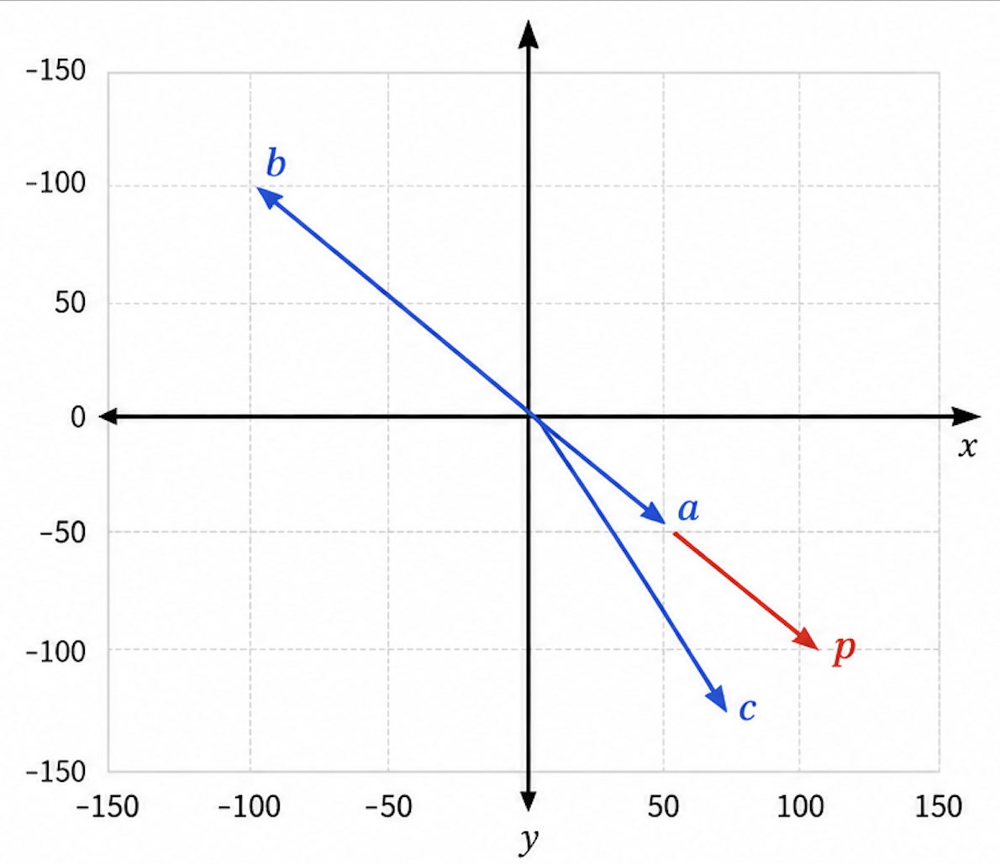

### 向量数据库

一种专门用于存储、管理和检索向量数据（即高维数值数组 --> 浮点数类型的数组）的数据库系统。

其核心功能是通过高效的索引结构和相似性计算算法，支持大规模向量数据的快速查询与分析，向量数据库维度越高，查询精准度也越高，查询效果也越好。

下方是LangChain支持的向量数据库List清单：

​	https://docs.langchain.com/oss/python/integrations/vectorstores

下方是LangChain4J支持的向量数据库List清单：

​	https://docs.langchain4j.dev/integrations/embedding-stores/

下方是SpringAI支持的向量数据库List清单：

​	https://docs.spring.io/spring-ai/reference/api/vectordbs.html

### 向量化存储能干嘛？

将文本、图像和视频转换为称为向量（Vectors）的浮点数数组在 VectorStore中，查询与传统关系数据库不同。它们执行相似性搜索，而不是精确匹配。当给定一个向量作为查询时，VectorStore 返回与查询向量“相似”的向量

> 总结：
>
> 将文本映射到高维空间中的点，使语义相似的文本在这个空间中距离较近。
>
> 例如，“肯德基”和”麦当劳”的向量可能会比”肯德基”和”新疆大盘鸡”的向量更接近

### 常用向量数据库：

官网：https://docs.langchain.com/oss/python/integrations/vectorstores#all-vector-stores

| 向量数据库    | 描述                                                         |
| ------------- | ------------------------------------------------------------ |
| FAISS         | 一个用于高效相似性搜索和密集向量聚类的库。                   |
| Chroma        | 开源的轻量级向量数据库，有极简的 API。                       |
| `Milvus`      | 开源的专为向量搜索设计的云原生数据库。性能强悍，功能丰富。覆盖轻量级的原型开发到十亿级向量的大规模生产系统。 |
| Pgvector      | 开源关系型数据库 PostgreSQL 的扩展，为 PostgreSQL 增加了向量数据类型和相似性搜索功能。 |
| `Redis`       | 开源内存数据结构存储，现已原生支持向量相似性搜索功能。       |
| Elasticsearch | 开源分布式搜索和分析引擎，提供了一个基于文档的数据库，结构化、非结构化和向量数据通过高效的列式存储统一管理。 |

## Embedding 文本向量化

**Embedding 是将文本字符串表示为向量（浮点数列表）**，通过计算向量之间的距离来衡量文本之间的相关性。

向量距离越小，表示文本之间的相关性越高；

距离越大，相关性越低。

### 阿里云百炼---文本嵌入模型（Embedding Model）

https://bailian.console.aliyun.com/cn-beijing?tab=api#/api/?type=model&url=2587654

#### DashScope 原生方式

```py
import os
import dashscope # 引入阿里云百练平台
from http import HTTPStatus


# 我们第一个做的事是文本向量化
# 把这段话变成浮点数的数组 --> 看看长什么样子 --> 然后把这段数组存到 milvus 或 redis 向量数据库里面 --> 然后做其他事情（查询...）
input_text = "衣服的质量杠杠的"
dashscope.api_key = os.getenv("aliQwen_api")  # 从环境变量读取

# 调用阿里云提供的文本向量化服务
resp = dashscope.TextEmbedding.call(
    model="text-embedding-v4", # 指定模型
    input=input_text, # 传入需要向量化的原始文本
)
# 检查API响应状态码是否为200（成功）
if resp.status_code == HTTPStatus.OK:
    print(resp) # 打印响应对象

# 阿里的默认大致是1024个位置
```

#### OpenAI 兼容模式（调用阿里云百炼）

```python
import os
from openai import OpenAI

input_text = "衣服的质量杠杠的"

# client 客户端
# 初始化 OpenAI 客户端（兼容阿里云百炼）
client = OpenAI(
    # 若没有配置环境变量，请用阿里云百炼API Key将下行替换为：api_key="sk-xxx",
    # 新加坡和北京地域的API Key不同。获取API Key：https://help.aliyun.com/zh/model-studio/get-api-key
    api_key=os.getenv("aliQwen_api"),
    # 以下是北京地域base-url，如果使用新加坡地域的模型，需要将base_url替换为：https://dashscope-intl.aliyuncs.com/compatible-mode/v1
    base_url="https://dashscope.aliyuncs.com/compatible-mode/v1"
)

completion = client.embeddings.create(
    model="text-embedding-v4",
    input=input_text
)
# model_dump_json()是 OpenAI SDK 中响应对象的一个方法，将响应对象序列化为 JSON 字符串
print(completion.model_dump_json())
```

### 文本嵌入模型（Embedding Model）

#### 阿里云百炼文本向量模型

```py
"""
https://bailian.console.aliyun.com/cn-beijing/?tab=api#/api/?type=model&url=2587654
pip install langchain-community dashscope
"""

# 必须放在所有 langchain 导入最前面
# 压制警告，可有可无
import warnings
warnings.filterwarnings(
    "ignore",
    category=DeprecationWarning,
    message="`langchain-community` is being sunset and is no longer actively maintained"
)

import os
# langchain引入外部的第三方包
from langchain_community.embeddings import DashScopeEmbeddings

# 初始化DashScopeEmbeddings实例
embeddings = DashScopeEmbeddings(
    model="text-embedding-v4", # 向量模型名称
    dashscope_api_key=os.getenv("aliQwen_api")  # API key
)

# 一段文本
text = "This is a test document."

# 调用 embed_query() 方法对单条文本进行向量化
query_result = embeddings.embed_query(text)
# sep='' 是 Python print() 函数的一个参数，用于控制多个输出值之间的分隔符
print("文本向量长度：", len(query_result), sep='')

# 调用 embed_documents() 方法批量向量化多条文本
doc_results = embeddings.embed_documents(
    [
        "Hi there!",
        "Oh, hello!",
        "What's your name?",
        "My friends call me World",
        "Hello World!"
    ])
print(doc_results)
print("文本向量数量：", len(doc_results), "，文本向量长度：", len(doc_results[0]), sep='')
```

#### 阿里云百炼文本向量模型 Pro版 -- 多模态

```py
import dashscope
import json
import os
from http import HTTPStatus

# Embedding 02文本向量化

# 调用多模态embedding模型接口进行向量编码
# https://bailian.console.aliyun.com/?productCode=p_efm&tab=model#/model-market/all?capabilities=ME
resp = dashscope.MultiModalEmbedding.call(
    model="tongyi-embedding-vision-plus",  # 支持 v1 或 v2
    api_key=os.getenv("aliQwen-api"),  # 从环境变量读取
    input=[{"text": "尚硅谷AI"}]
)

result = "";

# 处理模型返回结果，提取关键信息并格式化输出
if resp.status_code == HTTPStatus.OK:
    result = {
        "status_code": resp.status_code,
        "request_id": getattr(resp, "request_id", ""),
        "code": getattr(resp, "code", ""),
        "message": getattr(resp, "message", ""),
        "output": resp.output,
        "usage": resp.usage
    }
    print(json.dumps(result, ensure_ascii=False, indent=4))

print("=================================")
print()

# result 就是你已经拿到的完整 dict
# embedding_values = result["output"]["embeddings"][0]["embedding"]
# print(embedding_values)
# print("=================================")
# print("=================================")
# # 只打印 embedding 数组
# print(json.dumps(embedding_values, ensure_ascii=False))
```

#### 文本向量化的通用标准写法 -- OpenAI （最广泛通用的）

```python
import os
from langchain_openai import OpenAIEmbeddings

# 阿里云通义向量兼容OpenAI配置
embeddings = OpenAIEmbeddings(
    model="text-embedding-v4",
    api_key=os.getenv("aliQwen_api"),
    base_url="https://dashscope.aliyuncs.com/compatible-mode/v1",
    # 关闭长度校验，适配阿里云向量接口规则
    check_embedding_ctx_length=False
)

# 单文本向量化
text = "This is a test document."
query_result = embeddings.embed_query(text)
print("文本向量长度：", len(query_result), sep='')

# 批量文档向量化
doc_list = [
    "Hi there!",
    "Oh, hello!",
    "What's your name?",
    "My friends call me World",
    "Hello World!"
]
doc_results = embeddings.embed_documents(doc_list)

print(doc_results)
print("文本向量数量：", len(doc_results), "，文本向量长度：", len(doc_results[0]), sep='')
```

## Embadding 文本向量化存入向量数据库 - Redis版

### 用redisStacl作为向量存储

#### 官网：

https://docs.langchain.com/oss/python/integrations/vectorstores/redis

#### RedisStack是什么：

Redis Stack 是 Redis Labs 推出的一个**增强版 Redis**，不是 Redis 的替代品，而是在原来的基础上的功能扩展包，专为构建现**代实时应用**而设计

#### Redis Stack 相比原生 Redis 的优势：

| 功能维度 | 原生 Redis                 | Redis Stack 增强功能                                  |
| -------- | -------------------------- | ----------------------------------------------------- |
| 数据结构 | 字符串、列表、集合、哈希等 | 增加 JSON、图、时间序列、概率结构等高级类型           |
| 查询能力 | 仅限键值查询               | 支持全文搜索、向量搜索、图查询、JSON 查询             |
| 使用场景 | 缓存、消息队列、计数器等   | 实时推荐、时序分析、知识图谱、文档数据库、AI 向量检索 |
| 开发体验 | 命令行操作，需手动拼装逻辑 | 提供 RedisInsight 和对象映射库，开发效率更高          |

#### RedisStack核心组件：

- RediSearch：

​		提供全文搜索能力，支持复杂的文本搜索、聚合和过滤，以及向量数据的存储和检索

- RedisJSON：

​		原生支持JSON数据的存储、索引I和查询，可高效存储和操作嵌套的JSON文档。

- RedisGraph：

​		支持图数据模型，使用Cypher查询语言进行图遍历查询。

- RedisBloom:

​		支持 Bloom、Cuckoo、Count-Min Sketch等概率数据结构。

> 一句话(重要)：
>
> RedisStack = 原生Redis + 搜索 + 图 + 时间序列 + JSON + 概率结构 + 可视化工具 + 开发框架支持

#### RedisStack安装：

```bash
docker run -d --name redis-stack-server -p 6379:6379 redis/redis-stack-server
```

> **`flushall` 命令的作用是：清空当前 Redis 实例中所有数据库（默认 0-15 号库）里的所有键值对数据。**
>
> 这是一个非常危险的操作，执行后数据会被立即删除且无法回滚（除非有预先配置的 RDB 或 AOF 持久化文件可以恢复）。

```py
# pip install langchain-community dashscope redis==5.3.1

# 放在所有导入最顶部，精准过滤指定警告，不屏蔽其他警告
import warnings
warnings.filterwarnings(
    "ignore",
    category=DeprecationWarning,
    message="`langchain-community` is being sunset and is no longer actively maintained"
)

import os
# 阿里云通义向量
from langchain_community.embeddings import DashScopeEmbeddings
# Redis向量库
from langchain_community.vectorstores import Redis
from langchain_core.documents import Document

# 1. 初始化阿里千问 Embedding 模型
embeddings = DashScopeEmbeddings(
    model="text-embedding-v3",  # 支持 v1 或 v2
    dashscope_api_key=os.getenv("aliQwen_api")  # 从环境变量读取
)

# 2. 准备要向量化的文本（Document 列表）
texts = [
    "通义千问是阿里巴巴研发的大语言模型。",
    "Redis 是一个分布式内存数据库，也可以作为一种向量数据库。",
    "LangChain 与其他组件连接成链，可以轻松集成各种大模型借此构建AI工程应用"
]
documents = [Document(page_content=text, metadata={"source": "manual"}) for text in texts]

# 3. 连接到 Redis 并存入向量（自动调用 embeddings 嵌入）
# vector_store 意思：向量数据库
vector_store = Redis.from_documents(
    documents=documents,
    embedding=embeddings,
    redis_url="redis://localhost:6379",  # 替换为你的 Redis 地址
    index_name="my_index11",               # 向量索引名称
)

'''
vector_store 是一个包含了所有向量化文档的Redis向量数据库
as_retriever() 方法把这个数据库包装成一个标准化的检索接口 -> 这个检索器可以接收问题（文本），然后从数据库中找出最相关的文档

检索参数 search_kwargs={"k": 1}
k=1 表示每次检索只返回相似度最高的1条文档；如果改成 k=3，就会返回最相似的3条文档
'''

# 4. 将 Redis 向量库转为通用检索器，每次检索固定返回相似度最高 1 条文档，用于 RAG 检索流程。
retriever = vector_store.as_retriever(search_kwargs={"k": 1})

# 5. 打印
results = retriever.invoke("LangChain是什么？")
for res in results:
    print(res.page_content)
```

> 完整流程： 
>
> 你的文档库里有3条文本：
>
> 1. "通义千问是阿里巴巴研发的大语言模型。"
> 2. "Redis 是一个分布式内存数据库，也可以作为一种向量数据库。"
> 3. "LangChain 与其他组件连接成链，可以轻松集成各种大模型借此构建AI工程应用"
>
> retriever = vector_store.as_retriever(search_kwargs={"k": 1})
>
> 当你问 "LangChain是什么？"
>
> results = retriever.invoke("LangChain是什么？")
>
> Redis会：
>
> 1. 将你的问题也转换成向量（使用相同的embedding模型）
> 2. 计算问题向量与数据库里所有文档向量的相似度
> 3. 找出最相似的那条（因为k=1）
> 4. 返回这条文档 → 结果就是第3条关于LangChain的文本

```python
# EmbeddingStoreRedisV2.py

# pip install langchain langchain-openai redis==5.3.1 langchain-core dashscope
# 压制 langchain-community 弃用警告，必须放在所有导入最顶部
import warnings
warnings.filterwarnings(
    "ignore",
    category=DeprecationWarning,
    message="`langchain-community` is being sunset and is no longer actively maintained"
)

import os
from langchain_core.documents import Document
from langchain_community.embeddings import DashScopeEmbeddings
from langchain_community.vectorstores import Redis

# 初始化通义千问向量模型
embeddings = DashScopeEmbeddings(
    model="text-embedding-v3",
    dashscope_api_key=os.getenv("aliQwen_api")
)

# Redis配置常量
REDIS_URL = "redis://localhost:6379"
INDEX_NAME = "qwen_vector_index"
KEY_PREFIX = "qwen_doc:"

# 测试文档，携带完整元数据
texts = [
    "通义千问是阿里巴巴研发的大语言模型。",
    "Redis 是一个高性能的键值存储系统，支持向量检索。",
    "Milvus	开源的专为向量搜索设计的云原生数据库。性能强悍，功能丰富。覆盖轻量级的原型开发到十亿级向量的大规模生产系统",
    "LangChain 可以轻松集成各种大模型和向量数据库。"
]
documents = [Document(page_content=text, metadata={"source": "manual", "type": "tech"}) for text in texts]

# 创建 Redis 向量存储实例，并将文档向量化入库
def create_redis_store() -> Redis:
    vector_store = Redis.from_documents(
        documents=documents,
        embedding=embeddings,
        redis_url=REDIS_URL,
        index_name=INDEX_NAME,
        key_prefix=KEY_PREFIX
    )
    print("✅ 文档向量入库新增完成,共计插入文档记录条数：",len(documents))
    return vector_store

# 基础相似度检索
def simple_search(store: Redis, query: str, top_k=2):
    print(f"\n【基础相似检索】查询：{query}")
    res = store.similarity_search(query, k=top_k)
    for idx, doc in enumerate(res):
        print(f"结果{idx+1}: {doc.page_content} | 元数据:{doc.metadata}")
    return res

# 带相似度分值检索
def search_with_score(store: Redis, query: str, top_k=2):
    print(f"\n【带分值检索】查询：{query}")
    docs_score = store.similarity_search_with_score(query, k=top_k)
    for doc, score in docs_score:
        print(f"相似度:{score:.4f} 文本:{doc.page_content}")
    return docs_score

# 更新文档（先删后新增）
def update_demo(store: Redis):
    print("\n【更新文档演示,先删all后新增】")
    all_ids = store.client.keys(f"{KEY_PREFIX}*")
    if all_ids:
        store.delete(ids=all_ids)
    new_doc = Document(
        page_content="通义千问3 = qwen3.7-plus,是阿里新一代多模态大模型，支持图文、长文本理解",
        metadata={"source": "manual", "type": "llm"}
    )
    store.add_documents([new_doc])
    print("✅ 旧数据清空，写入更新文档，本次新增文档数量：1")
    ret = store.similarity_search("通义千问", k=1)
    print("更新后查询结果：", ret[0].page_content)

# 清空全部向量文档
def del_all(store: Redis):
    all_ids = store.client.keys(f"{KEY_PREFIX}*")
    if all_ids:
        store.delete(ids=all_ids)
        print(f"\n✅ 已删除全部 {len(all_ids)} 条文档")

if __name__ == "__main__":

    redis_vector = create_redis_store()

    simple_search(redis_vector, "什么是大语言模型")

    #search_with_score(redis_vector, "向量数据库有哪些")

    print()
    print("更新后查询=====================")
    update_demo(redis_vector)
    simple_search(redis_vector, "什么是大语言模型")
    print("更新后查询end=====================")

    del_all(redis_vector)

    empty_res = redis_vector.similarity_search("Redis", k=1)
    print("\n清空后检索到文档数量：", len(empty_res))
```

> add_documents 添加
>
> delete 删除
>
> similarity_search 相似性搜索
>
> similarity_search_with_score 带有分值的相似性搜索

### 动嘴编程 redis 版

```markdown
我当前在用 LangChain 做 RAG 项目，需要一个新的向量库集成。
请帮我写 EmbeddingStoreRedis0528.py，放在 07_embedding 目录下，功能如下：
【场景】将本地文档向量化后存入 Redis，支持基础检索与带分值检索
【向量模型】DashScopeEmbeddings（阿里云通义）
【向量库】Redis
【API Key】aliQwen-api
【索引名】比如:redis_0528_index
【检索方式】simple_search / search_with_score / update_demo / del_all
 
请严格参考 EmbeddingStoreRedisV2.py 的代码结构，包括：
- import 组织方式
- 函数签名风格
- 中文注释和打印格式
- __name__ == "__main__" 的演示串联
```

```python
# EmbeddingStoreRedis0528.py
# AI 生成的结果

# pip install langchain langchain-openai redis==5.3.1 langchain-core dashscope
# 压制 langchain-community 弃用警告，必须放在所有导入最顶部
import warnings
warnings.filterwarnings(
    "ignore",
    category=DeprecationWarning,
    message="`langchain-community` is being sunset and is no longer actively maintained"
)

import os
from langchain_core.documents import Document
from langchain_community.embeddings import DashScopeEmbeddings
from langchain_community.vectorstores import Redis

# 初始化通义千问向量模型
embeddings = DashScopeEmbeddings(
    model="text-embedding-v3",
    dashscope_api_key=os.getenv("aliQwen-api")
)

# Redis配置常量
REDIS_URL = "redis://localhost:26379"
INDEX_NAME = "redis_0528_index"
KEY_PREFIX = "qwen_doc_0528:"

# 测试文档，携带完整元数据
texts = [
    "通义千问是阿里巴巴研发的大语言模型，支持多种自然语言处理任务。",
    "Redis 是一个高性能的键值存储系统，支持向量检索和混合查询。",
    "Milvus 是开源的专为向量搜索设计的云原生数据库，性能强悍，功能丰富，覆盖轻量级原型开发到十亿级向量的大规模生产系统。",
    "LangChain 可以轻松集成各种大模型和向量数据库，构建复杂的 RAG 应用。",
    "向量检索技术通过将文本转换为高维向量，实现语义级别的相似度匹配。"
]
documents = [
    Document(page_content=text, metadata={"source": "manual", "type": "tech", "version": "0528"})
    for text in texts
]

def create_redis_store() -> Redis:
    """创建 Redis 向量存储实例，并将文档向量化入库"""
    vector_store = Redis.from_documents(
        documents=documents,
        embedding=embeddings,
        redis_url=REDIS_URL,
        index_name=INDEX_NAME,
        key_prefix=KEY_PREFIX
    )
    print("✅ 文档向量入库新增完成，共计插入文档记录条数：", len(documents))
    return vector_store

# 基础相似度检索
def simple_search(store: Redis, query: str, top_k=2):
    """基础相似度检索，返回文档内容及元数据"""
    print(f"\n【基础相似检索】查询：{query}")
    res = store.similarity_search(query, k=top_k)
    for idx, doc in enumerate(res):
        print(f"结果{idx+1}: {doc.page_content} | 元数据:{doc.metadata}")
    return res

# 带相似度分值检索
def search_with_score(store: Redis, query: str, top_k=2):
    """带相似度分值的检索，返回文档及对应的相似度分数"""
    print(f"\n【带分值检索】查询：{query}")
    docs_score = store.similarity_search_with_score(query, k=top_k)
    for doc, score in docs_score:
        print(f"相似度:{score:.4f} 文本:{doc.page_content}")
    return docs_score

# 更新文档（先删后新增）
def update_demo(store: Redis):
    """更新文档演示：先清空旧数据，再新增一条更新文档"""
    print("\n【更新文档演示，先删 all 后新增】")
    all_ids = store.client.keys(f"{KEY_PREFIX}*")
    if all_ids:
        store.delete(ids=all_ids)
        print(f"已删除 {len(all_ids)} 条旧文档")
    new_doc = Document(
        page_content="通义千问3 = qwen3.7-plus，是阿里新一代多模态大模型，支持图文、长文本理解和多语言翻译。",
        metadata={"source": "manual", "type": "llm", "version": "0528"}
    )
    store.add_documents([new_doc])
    print("✅ 旧数据清空，写入更新文档，本次新增文档数量：1")
    ret = store.similarity_search("通义千问", k=1)
    print("更新后查询结果：", ret[0].page_content)

# 清空全部向量文档
def del_all(store: Redis):
    """清空当前索引下的全部向量文档"""
    all_ids = store.client.keys(f"{KEY_PREFIX}*")
    if all_ids:
        store.delete(ids=all_ids)
        print(f"\n✅ 已删除全部 {len(all_ids)} 条文档")
    else:
        print("\n⚠️ 当前索引下没有文档需要删除")

if __name__ == "__main__":

    print("=" * 50)
    print("Redis 向量存储集成演示 (0528 版本)")
    print("=" * 50)

    # 1. 创建向量存储并入库
    redis_vector = create_redis_store()

    # 2. 基础相似检索演示
    simple_search(redis_vector, "什么是大语言模型")

    # 3. 带分值检索演示
    search_with_score(redis_vector, "向量数据库有哪些")

    # 4. 更新文档演示
    print()
    print("更新后查询=====================")
    update_demo(redis_vector)
    simple_search(redis_vector, "什么是大语言模型")
    print("更新后查询 end=====================")

    # 5. 清空全部文档
    del_all(redis_vector)

    # 6. 验证清空结果
    empty_res = redis_vector.similarity_search("Redis", k=1)
    print("\n清空后检索到文档数量：", len(empty_res))
```

## **Embedding** 文本向量化存入向量数据库 - Milvus版

### 官网

https://milvus.io/zh

### 在Docker中运行Milvus命令步骤（mac 版）

1. **启动 Docker Desktop**（双击启动 Docker Desktop ）

2. **下载 Docker Compose 配置文件**

打开终端执行以下命令（使用 macOS 自带的 `curl` 工具下载）：

```bash
curl -L https://github.com/milvus-io/milvus/releases/download/v2.6.2/milvus-standalone-docker-compose.yml -o docker-compose.yml
```

验证文件下载成功：

```bash
ls -l docker-compose.yml
# 正常应显示文件大小约 1788 字节，日期为当前时间
```

3. **启动 Milvus 服务**

在包含 `docker-compose.yml` 文件的目录下，执行：

```bash
docker compose up -d
```

首次执行过程：

会自动拉取三个 Docker 镜像：`milvusdb/milvus`、`quay.io/coreos/etcd`、`minio/minio`

验证是否启动成功：

```bash
docker ps
# 正常应看到三个容器：
# milvus-standalone（状态 Up）监听 19530 端口
# milvus-minio（状态 Up）
# milvus-etcd（状态 Up）
```

4. **验证 Milvus 是否可用**

端口检查：Milvus 默认监听 `19530` 端口

WebUI 访问：在浏览器打开 `http://127.0.0.1:9091/webui/`，可以看到 Milvus 的可视化管理界面

## Milvus 客户端图形化工具（attu）米尔维斯

### 官网 / 下载地址：

https://github.com/zilliztech/attu/tags

### 连接方式：

打开 Attu，填写地址 http://localhost:19530，用户名密码留空，点击 Connect 即可连接本地 Milvus 向量数据库

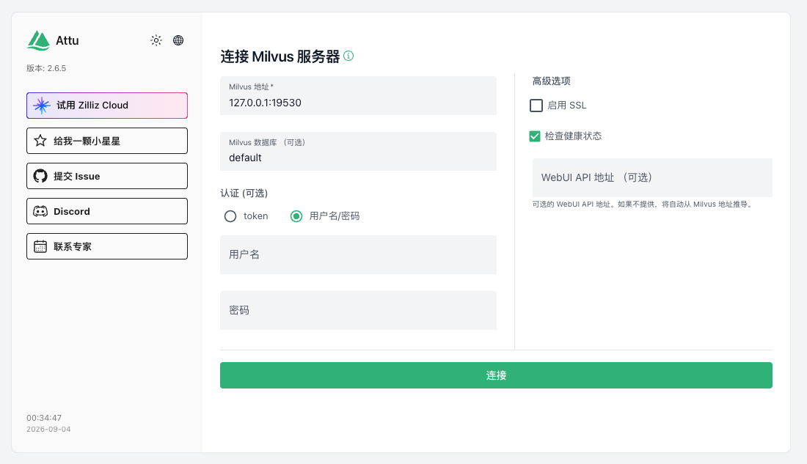

### 面试题：数据库mysql和向量数据milvus库有什么区别

MySQL 存的是"精确值"，用条件查；Milvus 存的是"特征向量"，用相似度查。

mysql的库 等价于 milvus的database

**mysql的表 等价于 milvus的collection**

一条条的记录 等价于 entity

### Milvus 数据模型

整体结构：

从业务逻辑角度，Milvus数据模型层级如下

```markdown
Database 数据库  -->  Collection 集合  -->  Partition 分区  -->  Entity 实体
```

**Database**：Milvus的数据库，用来隔离不同业务数据。

**Collection**：最核心的逻辑容器，类似于关系型数据库里的 table。

**Partiton**：分区，是collection的子集，不是必须手动创建；一个collection至少会有默认partition。

**Entity**：可以理解为 collection 中的一条记录。类似于关系型数据库的一行数据。

具体说明：

在传统数据库中，如果你想存储的是成千上万个“特征向量”以及他们对应的文本。为了把不同用途的向量分门别类地存放，我们就要创建不同的 Collection。比如，`COLLECTION_NAME = "docs"`就是给这张表取名叫`docs`，专门用来存放你切分好的文档片段向量。

### 代码步骤

```
pip install pymilvus
```

#### 数据库相关操作：

```py
# pip install pymilvus
from pymilvus import MilvusClient

# 操作客户端
client = MilvusClient("http://localhost:19530")
# 列出所有数据库
existed_databases = client.list_databases()

for db in existed_databases:
    print(db)

# 创建数据库
db_name = "rag_demo"

if db_name not in existed_databases:
    client.create_database(db_name = db_name)
else:
    print("Database {} already exists".format(db_name))

# 删除数据库
client.drop_database(db_name = db_name)
```

#### collection相关操作（类似于table）：

```python
# pip install pymilvus

from pymilvus import MilvusClient

# 操作客户端
client = MilvusClient("http://localhost:19530")

db_name = "db2"
# 切换到指定的数据库。
client.use_database(db_name = db_name)

# 获取当前数据库下的所有集合（Collection）名称列表。
collections = client.list_collections()
print("--Collectiond--")
for collection in collections:
    print(collection)
```

#### 文本向量化操作：

```python
from langchain_community.embeddings import DashScopeEmbeddings
import os

# 使用DashScope原生嵌入模型
embed_model = DashScopeEmbeddings(
    model="text-embedding-v3",
    dashscope_api_key=os.getenv("aliQwen-api"),
)

# 准备测试数据
texts = [
    "LangChain 是一个用于构建 LLM 应用的开发框架。",
    "04Milvus 是一个适合 AI 应用的向量数据库。",
    "RAG 的核心是先检索相关知识，再让大模型生成答案。",
    "Docker Desktop 可以方便地在本地运行 04Milvus Standalone。"
]

try:
    vectors = embed_model.embed_documents(texts)
    print(f"成功生成 {len(vectors)} 个向量")
    print(f"每个向量维度: {len(vectors[0])}")
    print(f"第一个向量前5个值: {vectors[0][:5]}")
except Exception as e:
    print(f"生成向量失败: {e}")
```

# Tools（function Calling）工具调用

## 不调用会如何

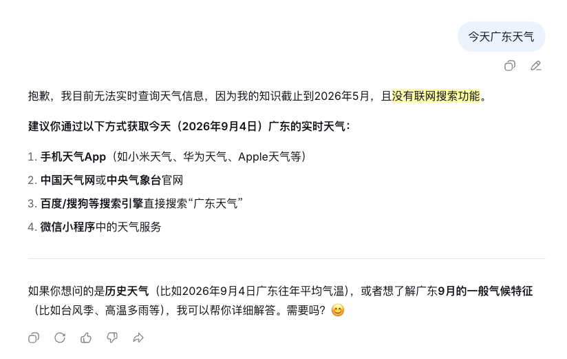

虽然大模型具备强大的语言理解和生成能力，但它本质上是静态的、不可交互的

- 不具备访问数据库、调用API
- 不能执行代码或文件操作
- 无法实现访问互联网或动态数据等

## 官网：

LangChain	https://docs.langchain.com/oss/python/langchain/tools

LangChain内置工具列表	https://docs.langchain.com/oss/python/integrations/tools

SpringAI	https://docs.spring.io/spring-ai/reference/api/tools.html

SpringAI Alibba	https://java2ai.com/docs/1.0.0.2/tutorials/basics/tool-calling/?spm=5176.29160081.0.0.2856aa5cgvn0gm

> 一句话	LLM的外部utils工具类

## 是什么

通过 Tool（工具）机制，可以让模型具备`“调用外部函数”的能力`，使其他能够与外部系统、API 或 自定义函数交互，从而完成仅靠文本生成无法实现的任务

> 重要提示：
>
> ToolCalling（也称为FunctionCalling）它允许大模型与一组API或工具进行交互，将LLM的智能与外部工具或API无缝连接，从而增强大模型其功能。
>
> LLM本身并不执行函数，它只是指示应该调用哪个函数以及如何调用

## 能干嘛

1. 访问实时数据（比如说上图的天气）
2. 执行某种工具类/辅助类操作：大语言模型（LLMs）不仅仅是文本生成的能手，他们还能触发并调用第3方函数，比如：发邮件/查询微信/调用支付宝/查看顺丰快递单据号等等...

## 怎么玩

 工作流程：（泳道图）

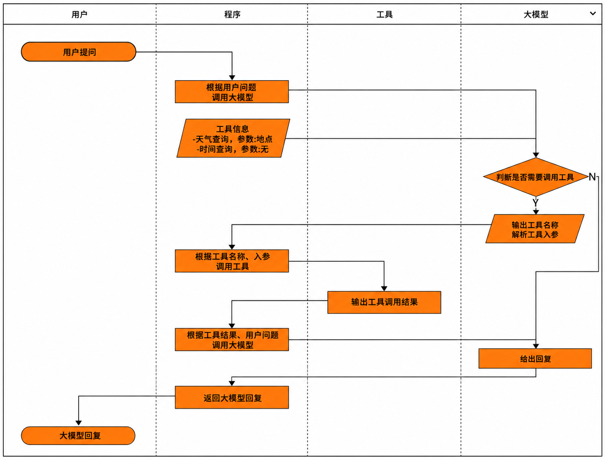

## 自定义Tool

### 使用@tool装饰器

在我们定义的一个方法上面写一个 @tool 将这个普通的python实例方法变成一个tool工具类

```python
from langchain.tools import tool

@tool
def search_database(query: str, limit: int = 10) -> str:
    """搜索客户数据库，返回匹配查询的记录。

    参数:
        query: 要搜索的查询词
        limit: 返回结果的最大数量
    """
    return f"Found {limit} results for '{query}'"
```

### Tool 常用属性

| 属性             | 类型               | 描述                                                         |
| ---------------- | ------------------ | ------------------------------------------------------------ |
| name 名字        | str                | 必选，在提供给LLM或Agent的工具集中必须是唯一的。             |
| description 描述 | str                | 可选但建议，描述工具的功能。LLM或Agent将使用此描述作为上下文，使用它确定工具的使用 |
| args_schema      | Pydantic BaseModel | 可选但建议，可用于提供更多信息（例如，few-shot示例）或验证预期参数。 |
| return_direct    | boolean            | 仅对Agent相关。当为True时，在调用给定工具后，Agent将停止并将结果直接返回给用户。 |

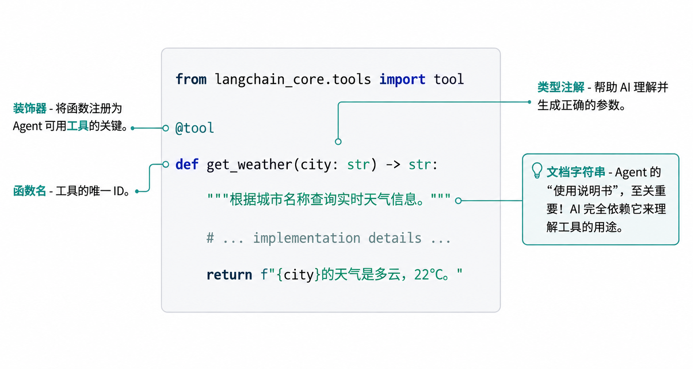

### 基础案例

```python
from langchain.tools import tool

@tool
def add_number(a: int, b: int) -> int:
    """两个整数相加"""
    return a + b

result = add_number.invoke({"a": 1, "b": 12})
print(result)

print()

# "=" 自描述表达式
print(f"{add_number.name=}\n{add_number.description=}\n{add_number.args=}")

# 打印结果如下
# add_number.name='add_number'
# add_number.description='两个整数相加'
# add_number.args={'a': {'title': 'A', 'type': 'integer'}, 'b': {'title': 'B', 'type': 'integer'}}
```

###  "=" 自描述表达式

| 写法         | 含义                          |
| ------------ | ----------------------------- |
| {变量名=}    | 自动展开为 `变量名=变量值`    |
| {对象.属性=} | 自动展开为 `对象.属性=属性值` |

Python 会自动：

1. 把 **表达式本身**（等号左边的内容）作为字符串
2. 把 **表达式的值** 作为等号右边的内容
3. 组合成 `表达式=值` 的格式输出

### Pydantic 说明

给类加上，pydantic.BaseModel 后，实例化那一刻就会按类型注解做

- 类型检查（int必须是 int，str必须是 str...）
- 自动转换（"123" -> 123，"true" -> True...）
- 字段缺失、超范围、格式不对都会抛出清晰的 ValidationError

> Pydantic = “类型注解 + 自动校验 + 转换”神器，让Python在运行时也能享受“静态类型”的安全感。

```py
from pydantic import BaseModel, ValidationError, StrictInt

class User(BaseModel):
    id: int
    name: str
    age: int = 0  # 可给默认值

try:
    # 自动把字符串转成 int
    u = User(id="41", name="z3") #  自动把字符串转成 int，可以通融。id: int
except ValidationError as e:
    print(e)

print(u.id, type(u.id))  # 42 <class 'int'>

print()
print("#"*30)
print()


class User2(BaseModel):
    id: StrictInt  # 改用严格整数类型，拒绝类型转换
    name: str
    age: int = 0  # 可给默认值

try:
    User2(id="abc", name="Bob") # 传错类型就报错 id: StrictInt
except ValidationError as e:
    print(e)

"""
1 validation error for User2
id
Input should be a valid integer [type=int_type, input_value='abc', input_type=str]
"""
```

```python
from langchain.tools import tool

'''
使用@tool装饰器
装饰器默认使用函数名称作为工具名称，但可以通过参数name_or_callable 来覆盖此设置。
同时，装饰器将使用函数的文档字符串作为工具的描述，因此函数必须提供文档字符串
'''

'''
需求：
定义了一个名为add_number的工具函数，用于执行两个整数相加操作。主要功能包括：

使用Pydantic定义参数模型FieldInfo，指定两个整数参数a和b
通过@tool装饰器将函数注册为LangChain工具，绑定参数schema
打印工具的元信息（名称、参数、描述等）并调用工具执行加法运算并输出结果
'''
from langchain_core.tools import tool
from loguru import logger
from pydantic import BaseModel, Field

# 使用Pydantic定义参数模型FieldInfo，指定两个整数参数a和b
'''
javad代码:
public class FieldInfo {
    private final int a;//第1个参数
    private final int b;//第2个参数
    public FieldInfo(int a, int b) {
        this.a = a;
        this.b = b;
    }
    //=====getter=====
}
'''
class FieldInfo(BaseModel):
    """
    定义加法运算所需的参数信息
    """
    a: int = Field(description="第1个参数")
    b: int = Field(description="第2个参数")


# 通过args_schema定义参数信息，也可以定义name、description、return_direct参数
# args_schema=FieldInfo --> 要遵守FieldInfo定义的规范
@tool(args_schema=FieldInfo)
def add_number(a: int, b: int) -> int:
    return a + b

# 打印工具的基本信息
logger.info(f"name = {add_number.name}")
logger.info(f"args = {add_number.args}")
logger.info(f"description = {add_number.description}")
logger.info(f"return_direct = {add_number.return_direct}")

# 调用工具执行加法运算
res = add_number.invoke({"a": 1, "b": 2})
logger.info(res)
```

## 天气助手开发 -- 实战案例

### Tool calling 原理

在发送信息给大模型的时候，携带着“工具”列表，这些工具列表代表着大模型能使用的工具。当大模型遇到用户提出的问题时，会先思考是否应该调用工具解决问题，如果需要调用工具，和普通消息不同，这种情况下会返回“function_call”类型的消息，请求方根据返回结果调用对应的工具得到工具输出，然后将之前的信息加上工具输出的信息一起发送给大模型，让大模型整合起来综合判断给出结果。


### 需求

实现了一个天气查询功能。通过调用OpenWeather API获取指定城市的实时天气数据，并将结果以自然语言形式输出。

主要步骤：包括构建请求、发送HTTP请求、解析JSON响应并格式化为易读的中文描述

登录https://home.openweathermap.org/api_keys，免费获取API Key，并写入`.env`文件中，方便后续进行天气查询。

### 天气免费官网

https://openweathermap.org/

### 定义工具

```python
import random
from langchain_core.tools import tool
import json
import os
import httpx
from dotenv import load_dotenv

# 加载 .env 文件
load_dotenv()  # 默认加载当前目录下的 .env 文件

# 读取环境变量
api_key = os.getenv("Weather_KEY")

@tool
def get_weather(loc):
    """
    查询即时天气函数
    :param loc: 必要参数，字符串类型，用于表示查询天气的具体城市名称。
                注意，中国的城市需要用对应城市的英文名称代替，例如如果需要查询北京市天气，
                则 loc 参数需要输入 'Beijing'/'shanghai'。
    :return: OpenWeather API 查询即时天气的结果。具体 URL 请求地址为：
             https://home.openweathermap.org/users/sign_in
             返回结果对象类型为解析之后的 JSON 格式对象，并用字符串形式进行表示，
             其中包含了全部重要的天气信息。
    """
    # Step 1. 构建请求 URL
    url = "https://api.openweathermap.org/data/2.5/weather"

    # Step 2. 设置查询参数，包括城市名、API Key、单位和语言
    # 程序没错，但是实际偶尔会有调用不成功的情况
    params = {
        "q": loc,
        "appid": api_key,
        "units": "metric",  # 使用摄氏度
        "lang": "zh_cn"  # 输出语言为简体中文
    }

    # Step 3. 发送 GET 请求获取天气数据 @GetMapping
    response = httpx.get(url, params=params, timeout=30)

    # Step 4. 解析响应内容为 JSON 并序列化为字符串返回
    data = response.json()
    #print(json.dumps(data))
    return json.dumps(data)


# 测试，4个城市随机出一个
cityList = ["beijing", "shanghai", "chengdu", "guangzhou"]
# random.choice(seq)	从序列中随机选一个元素
targetCity = random.choice(cityList)
result = get_weather.invoke(targetCity)
print(result)

# 网络报错，多调试几次或者等......
# httpx.ConnectTimeout: [WinError 10060] 由于连接方在一段时间后没有正确答复或连接的主机没有反应，连接尝试失败。
```

### 	大模型调用 Tool

```python
import os
from langchain_core.output_parsers import JsonOutputKeyToolsParser, StrOutputParser
from langchain_core.prompts import PromptTemplate
from langchain_openai import ChatOpenAI
from loguru import logger
from tools.QueryWeatherTool import get_weather


# 初始化大语言模型实例
llm = ChatOpenAI(
    model="qwen-plus",
    api_key=os.getenv("aliQwen_api"),
    base_url="https://dashscope.aliyuncs.com/compatible-mode/v1"
)

# 将模型与工具绑定，使其能够调用 get_weather 工具
llm_with_tools = llm.bind_tools([get_weather])

# 创建解析器，用于提取工具调用结果中的 JSON 数据
parser = JsonOutputKeyToolsParser(key_name=get_weather.name, first_tool_only=True)

# 构建工具调用链：模型 -> 解析器 -> 调用天气工具
get_weather_chain = llm_with_tools | parser | get_weather

# print(get_weather_chain.invoke("你好， 请问杭州的天气怎么样？"))
# print(get_weather_chain.invoke("你好， 请问深圳的天气怎么样？"))

# 上面2个直接调用打印的效果不太好，定义输出提示模板，将 JSON 天气数据转换为自然语言描述
output_prompt = PromptTemplate.from_template(
    """你将收到一段 JSON 格式的天气数据{weather_json}，请用简洁自然的方式将其转述给用户。
    以下是天气 JSON 数据：
    请将其转换为中文天气描述，例如：
    “北京现在天气：多云，气温 28℃，体感有点闷热（约 32℃），湿度 75%，微风（东南风 2 米/秒），
    能见度很好，大约 10 公里。建议穿短袖短裤。适合做户外运动。"
    """
)

#1 创建字符串输出解析器
output_parser = StrOutputParser()

#2 构建最终输出链：提示模板 -> 模型 -> 输出解析器
output_chain = output_prompt | llm | output_parser

#3 构建完整的处理链：天气查询链 ->将天气数据包装为字典格式 -> 输出链
full_chain = get_weather_chain | (lambda x: {"weather_json": x}) | output_chain

#4 执行完整链路，查询上海天气并打印结果
result = full_chain.invoke("请问西安今天的天气如何？")
logger.info(result)
```

# 检索增强生成 RAG⭐️

RAG（Retrieval-Augmented Generation）检索增强生成

## 是什么

### 官网：

https://docs.langchain.com/oss/python/integrations/retrievers

LLM的知识仅限于它所接受的训练数据。如果你想让一个 LLM 了解特定领域的知识或专有数据

简单的来说，RAG（检索增强生成）是一种从你的数据中查找相关信息，并在将提示词发送给LLM之前将其注入到提示词中的方法。这样一来，LLM就能获得（希望是）相关的信息，并基于这些信息进行回答，从而降低产生幻觉概率。

幻觉：已读乱回，已读不回，似是而非

### 核心设计理念

RAG技术就像给AI大模型装上了「实时百科大脑」，为了让大模型获取足够的上下文，以便获得更加广泛的信息源，**通过先查资料后回答的机制**，让AI摆脱传统模型的“知识遗忘和幻觉回复”困境

> 一句话：类似于考试时有不懂的，给你准备了小抄。

## 能干嘛

通过引入外部知识源来增强LLM的输出能力，传统的LLM通常基于其训练数据生成响应，但这些数据可能**过时或不够全面**。RAG允许模型在生成答案之前，从特定的知识库中检索相关信息，从而提供更加准确和上下文相关的回答

## 怎么玩

RAG 流程分为两个不同的阶段：索引和检索

### 时间复杂度

O(1) > O(log₂N) > O(N) > O(N²)

| 符号           | 名称       | 数据量 10 | 数据量 100 | 数据量 1000 | 示例算法             |
| :------------- | :--------- | :-------- | :--------- | :---------- | :------------------- |
| **O(1)**       | 常数阶     | 1 步      | 1 步       | 1 步        | 数组取值、哈希表查找 |
| **O(log₂N)**   | 对数阶     | 4 步      | 7 步       | 10 步       | 二分查找、平衡树     |
| **O(N)**       | 线性阶     | 10 步     | 100 步     | 1000 步     | 简单循环、遍历数组   |
| **O(N log₂N)** | 线性对数阶 | 40 步     | 700 步     | 10000 步    | 快速排序、归并排序   |
| **O(N²)**      | 平方阶     | 100 步    | 10000 步   | 1000000 步  | 嵌套循环、冒泡排序   |
| **O(2^N)**     | 指数阶     | 1024 步   | 巨大       | 灾难        | 递归斐波那契         |

> 一句话总结：RAG 索引的本质就是把检索复杂度从 O(N) 降到 O(log N)，让 100万 条数据也能在 50ms 内返回结果。没有索引，RAG 系统在数据量大时根本无法使用。

## RAG 文本处理核心知识

### LangChain 组件

langchain框架提供了丰富的组件帮助我们搭建 RAG应用，核心组件的介绍：

| LangChain        | 作用                               | 常用组件类                                                   |
| :--------------- | :--------------------------------- | :----------------------------------------------------------- |
| 文档加载器       | 对各种格式的文档信息进行加载       | `Document`（文档组件）、`UnstructuredPDFLoader`（PDF文档加载器）、`UnstructuredFileLoader`（文件文档加载器）、`UnstructuredMarkdownLoader`（Markdown文档加载器） |
| 文档分割器       | 将加载的文档分割成文档片段         | `RecursiveCharacterTextSplitter`（递归字符文本分割器）       |
| 文本嵌入模型组件 | 将文本信息向量化                   | `OpenAIEmbeddings`（OpenAI文本嵌入模型）、`HuggingFaceEmbeddings`（HuggingFace文本嵌入模型） |
| 向量数据库组件   | 将向量和元数据保存到向量数据库     | `VectorStore`（向量数据库，不同向量数据库有不同的实现类）    |
| 文本检索器       | 根据用户提问在向量数据库中进行检索 | `VectorStoreRetriever`（向量数据库检索器）                   |

① 先把文本变成一个Document对象

② 把长文章切成小碎片（一本书太厚，一次性给 AI 看会塞爆。所以按一定长度切成小片段。比如每段 50000 字）

③ 把文字变成数字向量

④ 把向量存进向量数据库

⑤ 根据问题去数据库里捞相关内容

### RAG标准流程

1. 在RAG准备阶段，LangChain通过文档加载器对各种格式的文档进行加载，转换为LangChain中的文档对象
2. 对文档对象进行分割，根据分割规则，分割成文档片段
3. 将文档片段通过文本嵌入模型组件，转换为向量，通过向量数据库组件，保存到向量数据库
4. 在RAG的使用阶段，用户首先提出问题，使用文本嵌入模型组件，将提问文本转换为向量数据，通过向量数据库检索器组件，进行相似性检索，返回关联的文本片段
5. 将相关的文档片段内容渲染到提示词模板中，作为提问问题的上下文传递给大模型，在上下文里做“阅读-理解-整合-生成”，最后把整理好的答案返回给用户

> 总结：RAG的核心卖点正是让生成模型利用检索到的外部知识再做一次深加工，从而给出连贯、准确且带引用的回答

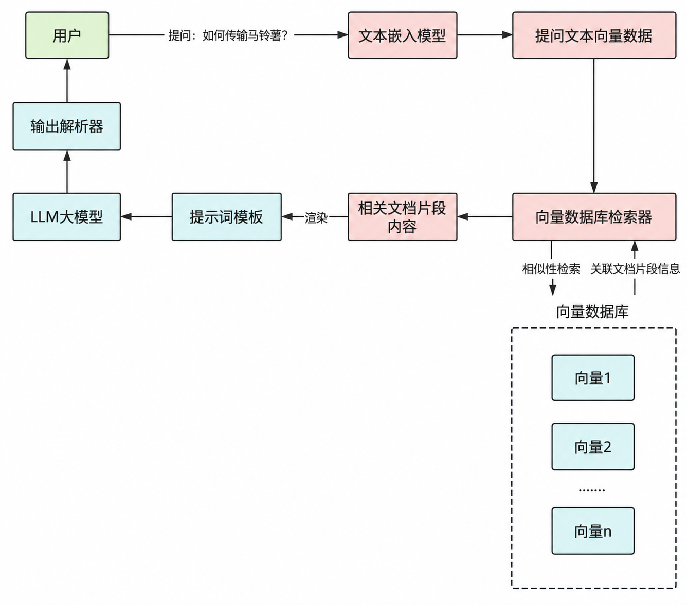

### 文档加载器

#### 官网

https://docs.langchain.com/oss/python/integrations/document_loaders

一句话理解：用于将各种格式的文档转换为Document对象

每一个文档加载器都有自己特定的参数和方法，但它们有一个统一的`load()`方法来完成文档的加载，load()方法会返回一个Document类对象列表，因为这些文档加载器都会继承自**BaseLoader**基类

#### Document文档类

文档加载器无论从什么来源进行文档加载，**最终都是为了将文档信息解析为Document对象**

Document类中，主要包括两个重要属性：

page_content：表示文档的内容，类型是字符串（正文）

metadata：与文档本身无关的元数据信息。可以保存文档ID、文件名等任意信息，类型是字典（补充条件的附件说明）

#### 文档加载器-代码案例

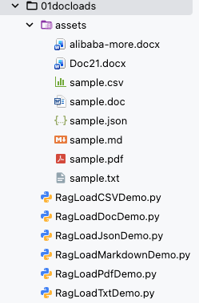

以JSON数据为例：

```json
{
  "status": "success",
  "data": {
    "page": 2,
    "per_page": 3,
    "total_pages": 5,
    "total_items": 14,
    "items": [
      {
        "id": 101,
        "title": "Understanding JSONLoader",
        "content": "This article explains how to parse API responses...",
        "author": {
          "id": "user_1",
          "name": "Alice"
        },
        "created_at": "2023-10-05T08:12:33Z"
      },
      {
        "id": 102,
        "title": "Advanced jq Schema Patterns",
        "content": "Learn to handle nested structures with...",
        "author": {
          "id": "user_2",
          "name": "Bob"
        },
        "created_at": "2023-10-05T09:15:21Z"
      },
      {
        "id": 103,
        "title": "LangChain Metadata Handling",
        "content": "Best practices for preserving metadata...",
        "author": {
          "id": "user_3",
          "name": "Charlie"
        },
        "created_at": "2023-10-05T10:03:47Z"
      }
    ]
  }
}
```

RagLoadJsonDemo.py

```python
# pip install jq
# 必须放在所有 langchain 导入最前面
import warnings
warnings.filterwarnings(
    "ignore",
    category=DeprecationWarning,
    message="`langchain-community` is being sunset and is no longer actively maintained"
)

from langchain_community.document_loaders import JSONLoader

# 提取所有字段
docs = JSONLoader(
    file_path="assets/sample.json",  # 文件路径
    jq_schema=".",  # 提取所有字段
    text_content=False,  # 提取内容是否为字符串格式
).load()

print(docs)
```

### 文本分割器

#### 官网

https://docs.langchain.com/oss/python/integrations/splitters

#### 为什么分割

文档太大，一口吞不下

文档太大，Token太费钱+有限制

#### LangChain提供了多种文本分割器，常用切分策略

| 分割器                           | 作用（人话版）                                               |
| :------------------------------- | :----------------------------------------------------------- |
| `RecursiveCharacterTextSplitter` | **递归按字符分割**：最常用。按段落→句子→词逐级往下切，尽量保证完整语义，防止切断关键信息。 |
| **CharacterTextSplitter**        | **按指定字符分割**：简单粗暴，按你指定的字符（如句号、换行）切，不管语义完不完整。 |
| **MarkdownHeaderTextSplitter**   | **按Markdown标题分割**：识别 `#`、`##`、`###` 等标题，按标题层级切分，保留文档结构。 |
| **PythonCodeTextSplitter**       | **专门分割Python代码**：懂 Python 语法，不会把函数、类定义拦腰切断。 |
| **TokenTextSplitter**            | **按Token数量分割**：按大模型计费的 Token 数切，适合控制输入长度，避免超限。 |
| **HTMLHeaderTextSplitter**       | **按HTML标题分割**：识别 `<h1>`、`<h2>` 等 HTML 标签，按标题层级切分网页内容。 |

大部分文本分割器都继承自TextSplitter基类，该类定义了分割文本的核心方法：

`split_text()`：将文本字符串分割成字符串列表

`split_document()`：将Document对象列表分割成更小文本片段的Document对象列表

`create_document()`：通过字符串列表创建Document对象

#### RecursiveCharacterTextSplitter(递归字符文本切分器)

##### 构造函数几个核心参数：

| 参数名             | 核心含义         | 详细说明                                                     |
| :----------------- | :--------------- | ------------------------------------------------------------ |
| chunk_size         | 文本块最大长度   | 单文本块最大字符数，可通过lenght_function自定义计数，适配模型上下文窗口（如GPT-3.5设3000左右） |
| chunk_overlap      | 文本块重叠长度   | 相邻块重叠字符数，保留上下文，需小于chunk_size，建议为10%-20% |
| separators         | 递归拆分分隔符   | 按优先级拆分，超尺寸则用下一分隔符，最后强制拆分，可自定义领域分隔符。 |
| length_function    | 长度计算函数     | 默认按字符计数，可自定义（如 tiktoken 按 token 计数，适配大模型）。 |
| keep_separator     | 是否保留分割符   | 默认 False 丢弃；True 保留于块末尾，助力保留原格式。         |
| Is_separator_regex | 分割符是否为正则 | 默认 False 按字符串匹配；True 按正则解析，支持复杂规则。     |

##### 分割文本-案例代码

RecursiveTextSplitterV1.py

```py
"""
使用split_text()方法进行文本分割
RecursiveCharacterTextSplitter中指定的
chunk_size=100,块大小为100，
chunk_overlap=30, 片段重叠字符数为30，
length_function=len，计算长度的函数使用len，# 可选：默认为字符串长度，可自定义函数来实现按 token 数切分
"""
from langchain_text_splitters import RecursiveCharacterTextSplitter

# 1.分割文本内容
content = (
    "大模型RAG（检索增强生成）是一种结合生成模型与外部知识检索的技术，通过从大规模文档或数据库中检索相关信息，"
    "辅助生成模型以提升回答的准确性和相关性。其核心流程包括用户输入查询、系统检索相关知识、"
    "生成模型基于检索结果生成内容，并输出最终答案。RAG的优势在于能够弥补生成模型的知识盲区，"
    "提供更准确、实时和可解释的输出，广泛应用于问答系统、内容生成、客服、教育和企业领域。"
    "然而，其也面临依赖高质量知识库、可能的响应延迟、较高的维护成本以及数据隐私等挑战。")


# 2.定义递归文本分割器
# 使用RecursiveCharacterTextSplitter创建文本分割器，设置块大小为100，重叠长度为30,
# length_function=len就是指定使用 Python 内置的len()函数来计算文本长度，也是这个分割器的默认值
# 比如，print(len("大模型RAG技术"))  # 输出8，因为统计的是字符个数（中文字符、字母、符号各算1个）
# 遵循 “重叠后向前取有效内容、且不生成过小碎片” 的核心分割逻辑，不会让最后一个片段的有效内容只剩扣除重叠后的少量字符
# 原始文本 → split_text → 第一次分割成字符串块 → create_documents → 对字符串块二次分割 → 内容丢失有可能
recursive_text_splitter = RecursiveCharacterTextSplitter(
    chunk_size=100,
    chunk_overlap=30,
    length_function=len
)

# 3.分割文本
# 将原始文本内容分割成多个文本块
splitter_texts = recursive_text_splitter.split_text(content)

# 4.转换为文档对象
# 将分割后的文本块转换为文档对象列表
splitter_documents = recursive_text_splitter.create_documents(splitter_texts)
print(f"原始文本大小：{len(content)}")
print(f"分割文档数量：{len(splitter_documents)}")
for splitter_document in splitter_documents:
    print(f"文档片段大小：{len(splitter_document.page_content)},"
          f"文档内容：{splitter_document.page_content}")


'''
原始文本大小：225

分割文档数量：3

文档片段大小：100,文档内容：大模型RAG（检索增强生成）是一种结合生成模型与外部知识检索的技术，通过从大规模文档或数据库中检索相关信息，辅助生成模型以提升回答的准确性和相关性。其核心流程包括用户输入查询、系统检索相关知识、生成模

文档片段大小：100,文档内容：相关性。其核心流程包括用户输入查询、系统检索相关知识、生成模型基于检索结果生成内容，并输出最终答案。RAG的优势在于能够弥补生成模型的知识盲区，提供更准确、实时和可解释的输出，广泛应用于问答系统、内容

文档片段大小：85,文档内容：区，提供更准确、实时和可解释的输出，广泛应用于问答系统、内容生成、客服、教育和企业领域。然而，其也面临依赖高质量知识库、可能的响应延迟、较高的维护成本以及数据隐私等挑战。
'''

'''
验证总字符的逻辑（并非简单相加）
同学们可能会疑惑：100+100+85=285，比原始 225 多了 60，why?
这是因为重叠部分被重复计算了，实际原始文本的有效内容被完整覆盖，且无丢失：
第 1 块和第 2 块的重叠：30 字符（重复计算 1 次）
第 2 块和第 3 块的重叠：30 字符（重复计算 1 次）
总重复计算：60 字符 → 285 - 60 = 225（和原始文本长度一致）

这正是分割器设计chunk_overlap的目的：
以 “重复计算重叠部分” 为代价，保证每个文本块的语义完整性，避免分割切断上下文。
'''

```

RecursiveTextSplitterV2.py

```py
from langchain_text_splitters import RecursiveCharacterTextSplitter
from langchain_core.documents import Document

# 原始文本内容
content = (
    "大模型RAG（检索增强生成）是一种结合生成模型与外部知识检索的技术，通过从大规模文档或数据库中检索相关信息，"
    "辅助生成模型以提升回答的准确性和相关性。其核心流程包括用户输入查询、系统检索相关知识、"
    "生成模型基于检索结果生成内容，并输出最终答案。RAG的优势在于能够弥补生成模型的知识盲区，"
    "提供更准确、实时和可解释的输出，广泛应用于问答系统、内容生成、客服、教育和企业领域。"
    "然而，其也面临依赖高质量知识库、可能的响应延迟、较高的维护成本以及数据隐私等挑战。")

# 定义递归文本分割器
text_splitter = RecursiveCharacterTextSplitter(
    chunk_size=100,
    chunk_overlap=30,
    length_function=len
)

# 核心：先调用split_text分割为字符串列表
splitter_texts = text_splitter.split_text(content)
# 手动转换为Document对象，保证内容完整
splitter_documents = [Document(page_content=text) for text in splitter_texts]

# 拼接所有分割后的内容（剔除重叠部分）验证完整性
full_content = ""
for text in splitter_texts:
    if full_content:
        full_content += text[30:]  # 剔除重叠的30个字符后拼接
    else:
        full_content += text

# 打印验证结果
print(f"原始文本大小：{len(content)}，原始内容：\n{content}\n")
print(f"分割文档数量：{len(splitter_documents)}\n")
for idx, splitter_document in enumerate(splitter_documents, 1):
    print(f"第{idx}个文档 - 大小：{len(splitter_document.page_content)}, "
          f"内容：{splitter_document.page_content}\n")

# 最终完整性验证
print(f"拼接后文本大小：{len(full_content)}")
print(f"是否与原始文本完全一致：{full_content == content}")
print(f"拼接后完整内容：\n{full_content}")

```

##### 分割文档对象 - 案例代码

RecursiveCharacterTextSplitter不仅可以分割纯文本，还可以直接分割Document对象

```bash
# windows 专用的预编译包
pip install python-magic-bin
```

```python
"""
 pip install python-magic-bin
分割文档对象
RecursiveCharacterTextSplitter不仅可以分割纯文本，还可以直接分割Document对象
"""
# pip install python-magic-bin
from langchain_text_splitters import RecursiveCharacterTextSplitter
from langchain_unstructured import UnstructuredLoader

# 1.创建文档加载器，进行文档加载
loader = UnstructuredLoader("rag.txt")
documents = loader.load()

# 2.定义递归文本分割器
# 创建RecursiveCharacterTextSplitter实例，用于将文档分割成指定大小的文本块
# chunk_size: 每个文本块的最大字符数为100
# chunk_overlap: 相邻文本块之间的重叠字符数为30
# length_function: 使用len函数计算文本长度
text_splitter = RecursiveCharacterTextSplitter(chunk_size=100, chunk_overlap=30, length_function=len)

# 3.分割文本
# 使用文本分割器将加载的文档分割成多个较小的文档片段
splitter_documents = text_splitter.split_documents(documents)

# 输出分割后的文档信息
print(f"分割文档数量：\n{len(splitter_documents)}")

print()

for splitter_document in splitter_documents:
    print(f"文档片段：{splitter_document.page_content}")
    print(f"文档片段大小：{len(splitter_document.page_content)}, "
          f"文档元数据：{splitter_document.metadata}")
    print()

```

## 案例代码

读取文档存入redis：

```py
from langchain_redis import RedisConfig, RedisVectorStore
from langchain_community.embeddings import DashScopeEmbeddings
import os

# 初始化 Embedding 模型
# 1. 初始化阿里千问 Embedding 模型
embeddingsModel = DashScopeEmbeddings(
    model="text-embedding-v3",  # 支持 v1 或 v2
    dashscope_api_key=os.getenv("aliQwen_api")  # 从环境变量读取
)

# ========== 存储数据 ==========
# 定义待处理的文本数据列表
texts = [
    "我喜欢吃苹果",
    "苹果是我最喜欢吃的水果",
    "我喜欢用苹果手机",
]
# query_result = embeddings.embed_query(texts)
# print(query_result)


# 获取文本向量
# 使用embedding模型将文本转换为向量表示
embeddings = embeddingsModel.embed_documents(texts)

# 打印结果
# 遍历并打印每个文本及其对应的向量信息
for i, vec in enumerate(embeddings, 1):
    print(f"文本 {i}: {texts[i-1]}")
    print(f"向量长度: {len(vec)}")
    print(f"前10个向量值: {vec[:10]}\n")

# 定义每条文本对应的元数据信息
metadata = [{"segment_id": "1"}, {"segment_id": "2"}, {"segment_id": "3"}]

# 配置Redis连接参数和索引名称
config = RedisConfig(
    index_name="newsgroups",
    redis_url="redis://localhost:6379",
)

# 创建Redis向量存储实例
vector_store = RedisVectorStore(embeddingsModel, config=config)

# 将文本和元数据添加到向量存储中
ids = vector_store.add_texts(texts, metadata)

# 打印前5个存储记录的ID
print(ids[0:5])
```

查找向量数据库redis做相似比较分数：

```py
from langchain_redis import RedisConfig, RedisVectorStore
from langchain_community.embeddings import DashScopeEmbeddings
import os

# 初始化 Embedding 模型
# 1. 初始化阿里千问 Embedding 模型
embeddingsModel = DashScopeEmbeddings(
    model="text-embedding-v3",  # 支持 v1 或 v2
    dashscope_api_key=os.getenv("aliQwen-api")  # 从环境变量读取
)

# 2. 创建Redis向量存储实例
vector_store = RedisVectorStore(
    embeddingsModel,
    config=RedisConfig(index_name="newsgroups", redis_url="redis://localhost:6379")
)

# ========== 查询数据 ==========
# 定义查询文本
query = "我喜欢用什么手机"

# 3. 将查询语句向量化，并在Redis中做相似度检索
results = vector_store.similarity_search_with_score(query, k=3)

print("=== 查询结果 ===")
for i, (doc, score) in enumerate(results, 1):
    similarity = 1 - score  # score 是距离，可以转成相似度
    print(f"结果 {i}:")
    print(f"内容: {doc.page_content}")
    print(f"元数据: {doc.metadata}")
    print(f"相似度: {similarity:.4f}")

```

## AI智能运维案例

某系统涉及后续自动化运维，需要根据响应码让大模型启动自迭代/自维护模型

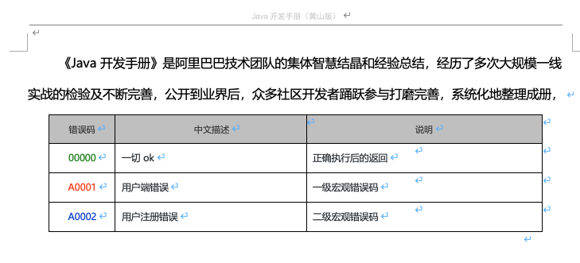

AI智能运维助手，通过提供的错误编码，给出异常解释辅助运维人员更好的定位问题和维护系统

<span style="color: red;">LangChain + 阿里百练嵌入模型text-embedding-3 + 向量数据库RedisStack + DeepSeek来实现RAG功能。</span>

- before：没有使用*RAG*，直接查询大模型，出现歧义
- after:

```py
# pip install unstructured
# pip install docx2txt
# pip install python-docx
from langchain.chat_models import init_chat_model
import os
from langchain_community.document_loaders import Docx2txtLoader
from langchain_core.prompts import PromptTemplate
from langchain_classic.text_splitter import CharacterTextSplitter
from langchain_core.runnables import RunnablePassthrough
from langchain_community.embeddings import DashScopeEmbeddings
from langchain_community.vectorstores import Redis


# 没有使用RAG，直接查询大模型，出现歧义，上课时先给学生演示before情况，没有用RAG
# main主入口先执行AIOM_WithOut_Assistant()方法给同学们演示
def AIOM_WithOut_Assistant():
    llm = init_chat_model(
        model="qwen-plus",
        model_provider="openai",
        api_key=os.getenv("aliQwen_api"),
        base_url="https://dashscope.aliyuncs.com/compatible-mode/v1"
    )

    response = llm.invoke("00000是什么意思")

    print(response.content)


def AIOM_Assistant():
    llm = init_chat_model(
        model="qwen-plus",
        model_provider="openai",
        api_key=os.getenv("aliQwen_api"),
        base_url="https://dashscope.aliyuncs.com/compatible-mode/v1"
    )

    prompt_template = """
    请使用以下提供的文本内容来回答问题。仅使用提供的文本信息，
    如果文本中没有相关信息，请回答"抱歉，提供的文本中没有这个信息"。

    文本内容：
    {context}

    问题：{question}

    回答：
    "
"""

    prompt = PromptTemplate(
        template=prompt_template,
        input_variables=["context", "question"]
    )

    # 1. 初始化阿里千问 Embedding 模型
    embeddings = DashScopeEmbeddings(
        model="text-embedding-v3",  # 支持 v1 或 v2
        dashscope_api_key=os.getenv("aliQwen_api")  # 从环境变量读取
    )

    # 4. 加载文档
    # LangChain提供了Docx2txtLoader专门用于加载.docx文件，先通过pip install docx2txt
    loader = Docx2txtLoader("alibaba-java.docx")  # 直接传入文件路径即可
    documents = loader.load()

    # 5. 分割文档
    text_splitter = CharacterTextSplitter(chunk_size=1000, chunk_overlap=0, length_function=len)
    texts = text_splitter.split_documents(documents)

    print(f"文档个数:{len(texts)}")

    # 6. 创建向量存储
    # 连接到 Redis 并存入向量（自动调用 embeddings 嵌入）
    vector_store = Redis.from_documents(
        documents=texts,
        embedding=embeddings,
        redis_url="redis://localhost:6379",  # 替换为你的 Redis 地址
        index_name="my_index3",  # 向量索引名称
    )

    retriever = vector_store.as_retriever(search_kwargs={"k": 2})

    # 8. 创建Runnable链
    rag_chain = (
            {
                "context": retriever,
                "question": RunnablePassthrough()
            }
            | prompt
            | llm
    )

    # 9. 提问
    question = "00000和A0001分别是什么意思"
    result = rag_chain.invoke(question)
    print("\n问题:", question)
    print("\n回答:", result.content)


if __name__ == '__main__':
    # AIOM_WithOut_Assistant()

    AIOM_Assistant()

```

# MCP（模型上下文协议Model Context Protocol）

MCP 就像是 AI 的 **"USB-C 通用接口"**，让大模型可以标准化地接入各种工具、数据库和服务。

<span style="color: red;">MCP就是Tool calling工具调用的服务封装加强增强版</span>

我去调用百度的MCP服务，这一个MCP服务里面就封装了一堆Tool calling

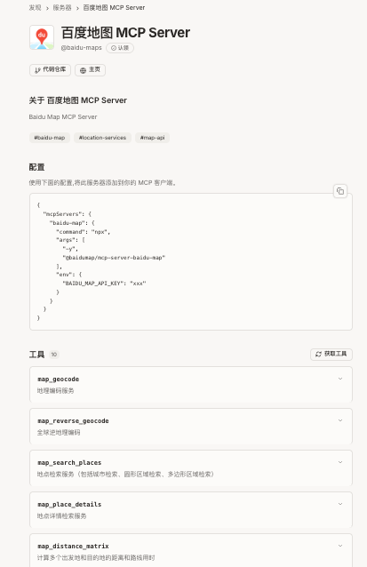

## MCP入门概念

### 是什么

MCP自身协议官网：https://modelcontextprotocol.io/introduction

MCP是一种开放协议，它标准化了应用程序如何向大语言模型（LLMs）提供上下文。可以将MCP想象成AI应用的USB-C端口。就像USB-C提供了一种标准化的方式将你的设备连接到各种外围设备的配件一样，MCP提供了一种标准化的方式将AI模型连接到不同的数据源和工具。

LangChain支持MCP协议官网：https://docs.langchain.org.cn/oss/python/langchain/mcp#custom-servers

> 大模型版的OpenFeign，OpenFeign用于微服务之间通讯，MCP用于大模型之间通讯

MCP就像是AI世界的"万能适配器"。

想象你有很多不同类型的服务和数据库，每个都有自己独特的"说话方式"。AI需要和这些服务交流时就很麻烦因为要学习每个服务的"语言"。

MCP解决了这个问题 - 它就像一个统一的翻译官，让AI只需学一种"语言"就能和所有服务交流。

这样开发者不用为每个服务单独开发连接方式，AI也能更容易获取它需要的信息。

如果你是一个后端同学，那么应该接触或听说过gRPC。gRPC通过标准化的通信方式可以实现不同语言开发的服务之间进行通信，那么MCP专门为AI模型设计的"翻译官和接口管理器"，让AI能以统一方式与各种应用或数据源交互。

### 能干嘛

提供了一种标准化的方式来连接LLMs需要的上下文，MCP就类似于一个Agent时代的Type-C协议，希望能将不同来源的数据、工具、服务统一起来供大模型调用

> 总结：
>
> MCP 厉害的地方在于，不用重复造轮子。
>
> 过去每个软件（比如微信、Excel）都要单独给 AI 做接口，
>
> 现在 MCP 统一了标准，就像所有电器都用 USB-C 充电口，AI 一个接口就能连接所有工具

### 怎么玩

调用上万个通用的MCP

第三方MCP市场：https://mcp.so/zh

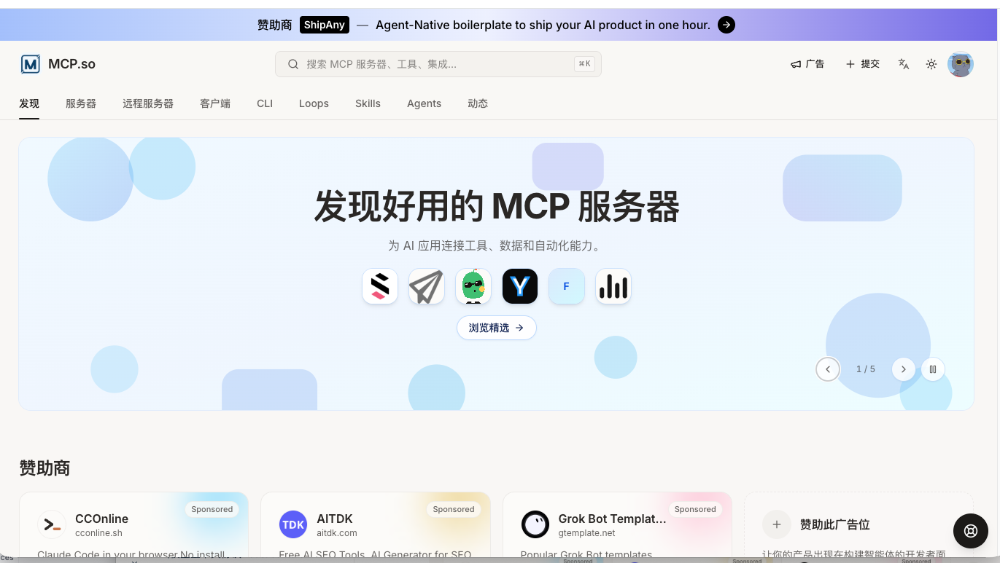

> <span style="color: red;">多说一句，自己本地搭建mcp客户端/服务端案例，P用没有，直接实战调用大厂真实对外暴露的服务</span>

## MCP架构知识

MCP遵循客户端-服务器架构（CS架构）

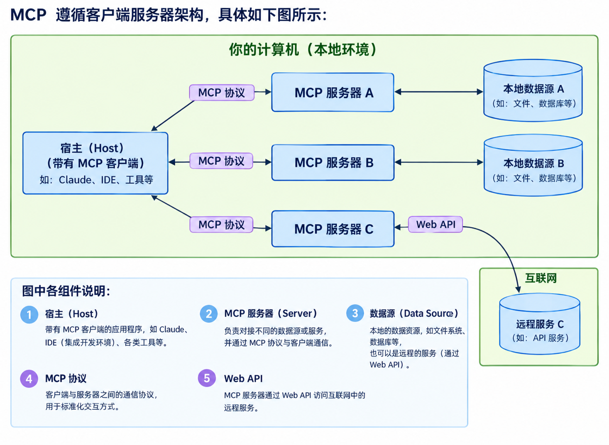

在MCP通信协议中，一般有两种模式：

- STDIO(标准输入/输出) 同步
- SSE (Server-Sent Events) 流式

两者对比：

| 特性     | SSE                              | STDIO                                |
| -------- | -------------------------------- | ------------------------------------ |
| 传输协议 | HTTP（长连接）                   | 操作系统级文件描述符                 |
| 方向     | 服务器 → 客户端（单向推送）      | 双向流（stdin, stdout）              |
| 保持连接 | 长连接（Connection: keep-alive） | 不保证长时间打开，取决于进程生命周期 |
| 数据格式 | 文本流（EventStream 格式）       | 原始字节流                           |
| 异常处理 | 可通过 HTTP 状态码或重连机制     | 进程退出或管道断裂                   |

## 案例实战

本案例必须跑在python3.12.7及以下版本

```bash
pip install langchain-mcp-adapters
```


