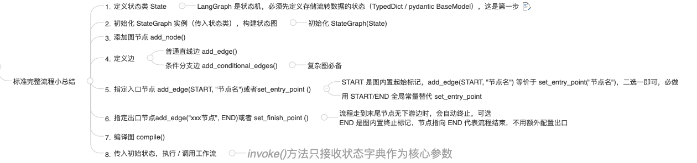

# LangGraph概述

## 是什么

### 官网

LangGraph 概述：https://docs.langchain.org.cn/oss/python/langgraph/overview

### 一句话

基于 LangChain 构建的、面向智能体多轮交互 / 状态持久化 / 分支并行执行的图结构工作流框架

>  LangGraph = LangChain + 图编排 + 状态机

### LangChain的困境：

Chain太死板，无法优雅地处理循环和条件分支，不适合复杂任务。

Agent太自由，像个黑箱，难以控制，调试和保证稳定性。

## 能干嘛

彻底打破了“链”的束缚，引入了“图”的结构，让构建复杂AI应用的可能性，从一条直线，变成了一张网

## 去哪下

https://docs.langchain.org.cn/oss/python/langgraph/install

```bash
pip install -U langgraph
```

## 面试图：

构建LangGraph四大要素：State（状态）、Nodes（节点）、Edges（边）、Graph（图）

# HelloWorld快速入门

LangGraph是基于LangChain构建的，无论图结构多复杂，单独每个任务执行链路仍然是线性的，其背后仍然是靠着LangChain的Chain来实现的。

LangChain和LangGraph之间的关系：LangGraph是LangChain工作流的高级编排工具，其中“高级”之处就是LangGraph能按照图结构来编排工作流。

## 可视化

通过 `graph.get_graph()`方法可以获取图的结构信息，包括节点和边的详细信息。

## 标准完整流程小总结



# Graph API 之 Graph(图)

官网：https://docs.langchain.org.cn/oss/python/langgraph/graph-api#graphs

图是一种由节点和边组成的用于描述节点之间关系的数据结构

# Graph API之State(状态)

官网：https://docs.langchain.org.cn/oss/python/langgraph/graph-api#state

State是一个贯穿整个工作流执行过程中的**共享数据的结构，代表当前块照**，它存储了从工作流开始到结束的所有必要的消息

定义图时，首先要做的是定义图的State。State由图的**schema**以及**reducer函数**组成

## Schema

规定了数据必须遵守的格式和规则

LangGraph 提供三层 TypedDict 类型约束：state_schema、input_schema、output_schema

State可以是TypedDict类型，也可以是pydantic中的BaseModel类型

### state_schema（完整全局状态）

图内部所有节点全程共享的完整状态字典，包含流程里所有中间变量、临时私有字段、输入衍生字段、最终结果字段，是整张图运行的完整数据容器。节点读写、状态合并全部基于这套完整结构。

```python
# 1. state_schema：整张图运行时完整全局状态，包含所有输入、中间、私有、输出字段
class MyStateFull(TypedDict):
    rag_result:str        # RAG知识库检索中间结果（内部中间值）
    web_search_result:str # 互联网搜索中间结果（内部中间值）
    final_answer:str      # 最终回答（对外输出字段）
    query:str             # 用户提问（唯一允许外部传入的参数）
    # a_new_key:str         # 节点内部生成的私有临时状态，外部不可控、默认不输出
    # phone:str
```

### input_schema（外部入参规范）

限制外部调用 invoke () 时，只允许传入的键值对；外部多传多余 key 会被直接过滤，不会写入全局 state，实现入参校验与隔离。

```python
# 2. input_schema：约束外部调用时，仅能传入的参数集合
# 外部invoke只能传这里定义的key，多传的键会被LangGraph直接过滤扔掉
class InputSchema(TypedDict):
    query:str
```

### output_schema（对外出参规范）

限制invoke 执行**结束返回结果**里只包含指定 key；内部大量中间、私有状态不会暴露给调用方，实现输出收口、隐私隔离。

```python
# 3. output_schema：约束图执行结束后，对外返回的结果集合
# 内部一堆中间、私有字段都会被隐藏，只返回此处声明的key
# output_schema 只对最终的返回值做限制，不影响中间节点的数据传递。
class OutputSchema(TypedDict):
    final_answer:str
```

> ### state_schema：内部完整容器；input_schema：入参白名单；output_schema：出参白名单

## Reducers

官网：https://docs.langchain.org.cn/oss/python/langgraph/graph-api#reducers

是什么：规约函数

规约函数决定了节点产生的更新如何作用到 State。State 中的每个字段都拥有自己的独立规约函数。

如果未显式指定，则默认所有对该字段的更新都会直接覆盖旧值。

### 状态合并策略（Reducers）

Reducer是定义多个节点之间State如何更新的（覆盖、合并、添加等）

### Reducer 常用函数


# Graph API之Node(节点)

官网：https://docs.langchain.com/oss/javascript/langgraph/graph-api#nodes

是什么：节点(Node)就是是Python函数（可以是同步的，也可以是异步的）

Node时LangGraph中的一个基本处理单元，代表工作流中的一个操作步骤，可以是一个Agent、调用大模型、工具或一个函数（**说白了就是绑定一个python函数，具体逻辑可以干任何事情**）

## 节点缓存Node Caching

key_func用于根据节点的输入生成缓存键，默认情况下是使用pickle对输入进行hash运算的结果。

ttl，即缓存的生存时间（以秒为单位）。如果未指定，缓存将永不过期。

```py
# 添加节点
builder.add_node(node="expensive_node",action=expensive_node,
    # 不用传key_fn，底层自动用默认逻辑
    cache_policy=CachePolicy(ttl=8)
)

.....

# 编译图，指定内存缓存
app = builder.compile(cache=InMemoryCache())
```

##  错误处理和重试机制（LangGraph 节点重试策略）

**默认重试策略**：max_attempts=5，对Exception重试、对ValueError/TypeError等不重试，异常过滤列表完全相同；
**自定义重试策略**：max_attempts=5 + custom_retry_on[自定义重试条件判断函数]，仅对包含{模拟API调用失败}的异常重试；throw new RuntimeExp("模拟API调用失败")
**不可重试测试**：ValueError直接抛错，无重试，max_attempts=3

> **节点函数报错 → 重新从头执行整个节点函数**

## 流式处理(Streaming)

官网：https://docs.langchain.com/oss/python/langgraph/streaming

values：每步结束后，输出完整的当前状态；

updates：每步结束后，只输出变化的部分；

messages：专门实时输出 LLM 的每一个字 / 词，还带相关信息（比如是哪个步骤调用的 LLM）；

custom：只输出你自定义的消息（比如进度提示）；

debug：输出所有细节，方便调试。

# Graph API之Edge(边)

官网：https://docs.langchain.com/oss/javascript/langgraph/graph-api#edges
是什么：Edge定义了节点之间的连接和执行顺序，以及不同节点之间是如何通讯的，一个节点可以有多个出边（指向多个节点），多个节点也可以同时指向同一个节点（Map-Reduce）

**Normal Edges: 普通边**：直接从一个节点连接到下一个节点。

## 条件边

**Conditional Edges: 条件边**：调用函数以确定接下来要前往哪个（哪些）节点。

### 可控循环

需要注意的是，这种带循环的图结构，有一个隐藏的问题：

图执行过程当中，可能因为某些原因，导致一直在循环内循环往复执行，因此LangGraph提供了一个**强制使图的执行终止的递归限制参数**

递归限制设定了图在抛出错误之前允许执行的超级步骤数量，默认值25，

在graph.invoke的config参数中指定。在经过指定数量的超级步骤后，图还没有自然停止执行时，**LangGraph会抛出异常GraphRecursionError**。

### Conditional Entry Point: 条件入口点

调用一个函数来确定当用户输入到达时，首先调用哪个（些）节点。 


